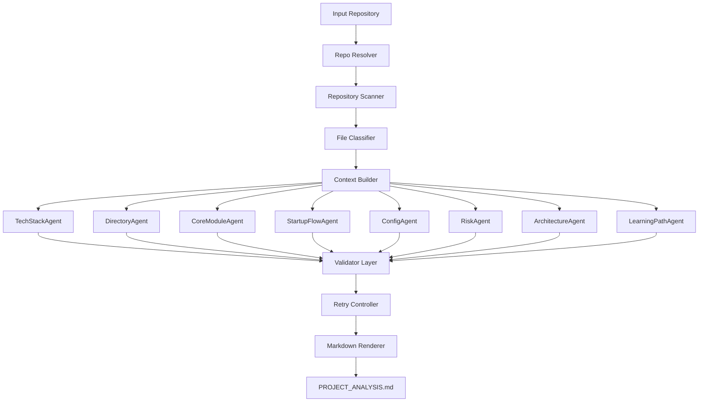
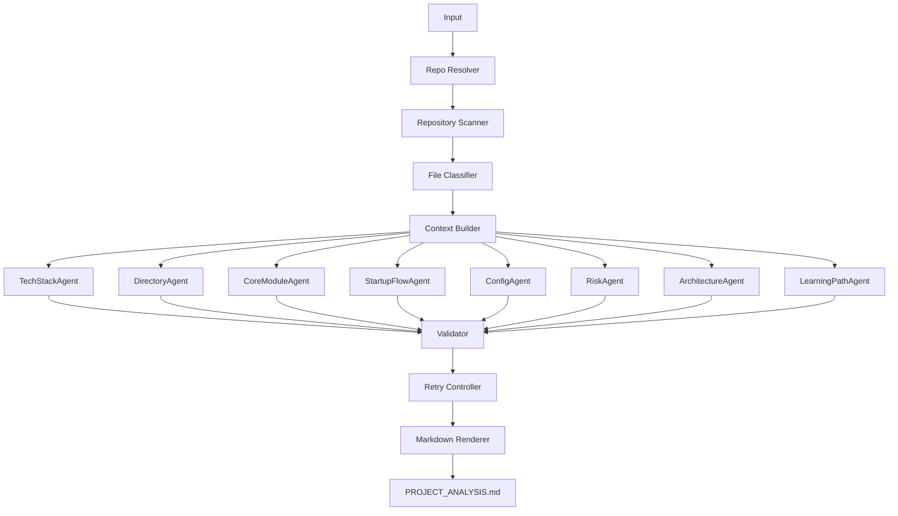

# AI GitHub 项目分析器 — Harness Engineering 架构设计文档 v1

> Version: v1.0  
> Status: Draft / SSOT（Single Source of Truth）  
> Architecture Style: Harness Engineering  
> Last Updated: 2026-05-14  
> Owner: Project Maintainer

---

# 目录（Table of Contents）

- [1. 项目定义](#1-项目定义project-definition)
- [2. 核心哲学](#2-核心哲学harness-engineering-philosophy)
- [3. 项目目标与非目标](#3-项目目标与非目标goals--non-goals)
- [4. 环境与约束](#4-环境与约束environment--constraints)
- [5. 系统总体架构](#5-系统总体架构system-architecture)
- [6. DAG 工作流设计](#6-dag-工作流设计dag-workflow-design)
- [7. Agent Contract](#7-agent-contract)
- [8. Prompt Contract](#8-prompt-contract)
- [9. Context Budget Strategy](#9-context-budget-strategy)
- [10. Validator Rule Engine](#10-validator-rule-engine)
- [11. Retry & Recovery](#11-retry--recovery)
- [12. Observability](#12-observability)
- [13. Security Design](#13-security-design)
- [14. Output Rendering](#14-output-rendering)
- [15. Project Structure](#15-project-structure)
- [16. MVP 执行计划](#16-mvp-执行计划)
- [17. 当前未闭环问题](#17-当前未闭环问题)
- [18. 验收标准](#18-验收标准)

---

# 1. 项目定义（Project Definition）

## 1.1 项目名称

**AI GitHub 项目分析器（AI Repository Architect）**

---

## 1.2 项目定位

本项目是一个：

> 面向任意代码仓库的 AI 架构分析系统。

目标不是：

> “让 AI 总结代码”

而是：

> 通过 Harness Engineering（驾驭工程）构建一个 **可控、可验证、可恢复、可观测** 的 AI Repository Understanding System。

系统能够：

- 输入 GitHub 仓库地址
- 输入本地项目路径
- 自动理解项目结构
- 自动分析技术栈
- 自动识别架构
- 自动发现风险
- 自动生成结构化分析文档

最终输出：

```txt
PROJECT_ANALYSIS.md
```

输出位置：

```txt
目标项目根目录
```

---

## 1.3 项目核心价值

### 对开发者

帮助开发者：

- 快速理解陌生项目
- 降低阅读成本
- 缩短上手时间
- 自动发现架构风险
- 获得学习路径

---

### 对团队

帮助团队：

- 新成员 onboarding
- 技术债识别
- 架构透明化
- 项目知识沉淀

---

### 对 AI Engineering 学习

本项目重点不在：

```txt
分析 GitHub
```

而在：

```txt
如何驾驭复杂 AI 系统
```

这是一个：

> Harness Engineering 实战项目。

---

# 2. 核心哲学（Harness Engineering Philosophy）

---

## 2.1 Human in Control

原则：

> 人类掌舵，AI 执行。

职责划分：

### Human

负责：

```txt
定义目标
定义约束
定义验证规则
定义失败策略
定义输出标准
```

---

### AI

负责：

```txt
执行分析
理解上下文
生成结构化结果
发现潜在问题
```

AI：

> 不拥有最终解释权。

---

## 2.2 AI Output Is Not Truth

原则：

> AI 输出不是真相。

任何 AI 输出：

必须经过：

```txt
Evidence Check
↓
Consistency Check
↓
Validation
↓
Retry if Failed
```

未经验证：

禁止进入最终报告。

错误：

```txt
AI 说什么就信什么
```

正确：

```txt
AI 输出只是候选结果
```

---

## 2.3 Deterministic First

优先级：

```txt
确定性规则
>
代码解析
>
配置解析
>
AI 推断
```

例如：

技术栈识别：

正确：

```txt
package.json
pom.xml
requirements.txt
go.mod
```

错误：

```txt
让 AI 猜
```

原则：

> 能确定就不要猜。

---

## 2.4 Prompt Is Replaceable

原则：

> Prompt 不是业务逻辑。

禁止：

```txt
把业务逻辑写死在 prompt 中
```

Prompt：

必须可替换。

标准：

```txt
input
constraints
output_schema
validator
retry_policy
```

必须解耦。

---

## 2.5 Context Is Budget

原则：

> Context 是预算，而不是无限资源。

系统必须：

```txt
预算化
裁剪
优先级控制
```

禁止：

```txt
整个仓库扔给模型
```

正确：

```txt
small context
strong signal
```

---

## 2.6 Failure Is Expected

原则：

> AI 必然失败。

失败：

不是异常。

失败：

是系统能力的一部分。

系统必须支持：

```txt
失败定位
失败回放
失败恢复
失败重试
```

---

## 2.7 Observable by Default

原则：

> 所有分析过程必须可观测。

每次运行：

必须记录：

```txt
输入
上下文
Prompt
Raw Response
Validation Result
Retry Log
Duration
```

支持：

```txt
debug
审计
质量分析
回归测试
```

---

# 3. 项目目标与非目标（Goals & Non-goals）

---

## 3.1 主目标

输入：

```txt
GitHub URL
或
本地路径
```

输出：

```txt
PROJECT_ANALYSIS.md
```

必须包含：

### 1. 技术栈分析

包括：

- 编程语言
- 框架
- 核心依赖
- 构建工具
- 部署工具

---

### 2. 项目目录说明

解释：

```txt
src/
config/
api/
service/
utils/
```

职责。

---

### 3. 核心模块职责

识别：

```txt
controller
service
repository
domain
middleware
```

模块职责。

---

### 4. 启动流程

说明：

```txt
环境准备
安装依赖
启动命令
构建命令
数据库初始化
```

---

### 5. 配置说明

分析：

```txt
yaml
json
properties
env.example
docker
```

---

### 6. 风险点分析

必须覆盖：

```txt
安全
性能
可维护性
扩展性
技术债
```

---

### 7. Mermaid 架构图

仅允许：

```txt
Mermaid
```

禁止：

```txt
ASCII 图
图片
```

---

### 8. 学习路线

输出：

```txt
建议阅读顺序
优先模块
学习路径
```

---

## 3.2 非目标（Non-goals）

系统不负责：

### 自动修复代码

禁止：

```txt
自动 patch
自动 commit
自动 PR
```

---

### 自动运行代码

默认：

```txt
不运行目标仓库
```

避免：

```txt
恶意代码执行
```

---

### 深度业务理解

系统：

仅负责：

```txt
工程架构层分析
```

不负责：

```txt
复杂业务推理
```

---

# 4. 环境与约束（Environment & Constraints）

## 4.1 技术环境

开发语言：

```txt
Python 3.12+
```

推荐：

```txt
uv
```

模型：

```txt
OpenAI API
Ollama
```

支持：

```txt
本地模型
云模型
```

文件处理：

```txt
pathlib
os
git
```

输出格式：

```txt
Markdown
Mermaid
JSON
```

---

## 4.2 硬性约束（Hard Constraints）

### 仓库克隆限制

仅允许：

```bash
git clone --depth 1
```

限制：

```txt
timeout = 60s
```

失败：

```txt
直接终止
```

---

### 文件数量限制

最大：

```txt
500 files
```

超过：

按优先级裁剪。

优先级：

```txt
config
entry
source
doc
test
generated
```

---

### 单文件读取限制

最大：

```txt
500 KB
```

超过：

仅读取：

```txt
前 200~300 行
```

必须标记：

```txt
[TRUNCATED]
```

---

### Context Budget 限制

单次模型调用：

必须：

```txt
严格预算控制
```

禁止：

```txt
依赖模型自动截断
```

---

### 安全限制

禁止读取：

```txt
.env
.secret
credentials
pem
private_key
```

允许：

```txt
.env.example
脱敏配置
```

## 4.3 软性建议（Soft Constraints）

### 优先并行

允许：

```txt
stack-analysis
risk-analysis
structure-analysis
```

并行执行。

原则：

> Independent First

避免：

```txt
串行阻塞
```

---

### 确定性优先

优先：

```txt
规则
>
Parser
>
AI
```

原则：

> 能确定就不要猜。

---

### 小 Context 高信号

原则：

> Small Context, Strong Signal

禁止：

```txt
超长 Prompt
整个仓库直接喂模型
```

推荐：

```txt
入口文件
关键配置
核心模块
README
```

优先。

---

# 5. 系统总体架构（System Architecture）

---

## 5.1 架构风格

系统采用：

> DAG + Multi-Agent + Validator Harness

核心设计：

```txt
Scanner
↓
Context Builder
↓
Multi-Agent Analysis
↓
Validation
↓
Retry
↓
Markdown Render
```

---

## 5.2 系统架构图



---

## 5.3 分层职责

系统分为：

```txt
6 Layers
```

---

### Layer 1 — Repository Scanner

职责：

```txt
扫描仓库
识别文件
建立文件索引
分类
```

禁止：

```txt
AI 推断
```

输入：

```txt
GitHub URL
Local Path
```

输出：

```json
{
  "files": [],
  "directories": [],
  "metadata": {}
}
```

---

### Layer 2 — Context Builder

职责：

```txt
构建模型上下文
裁剪
摘要
优先级排序
```

目标：

```txt
低 Token
高信息密度
```

输出：

```json
{
  "tech_stack_context": {},
  "risk_context": {},
  "startup_context": {}
}
```

---

### Layer 3 — Multi-Agent Analysis

职责：

```txt
结构化分析
```

要求：

```txt
单一职责
独立 Prompt
JSON 输出
```

禁止：

```txt
直接写 Markdown
```

---

### Layer 4 — Validator Layer

职责：

```txt
真实性验证
一致性验证
格式验证
```

包括：

```txt
Evidence Check
Cross Validation
Schema Validation
```

失败：

```txt
进入 Retry
```

---

### Layer 5 — Retry Controller

职责：

```txt
失败恢复
局部重试
Prompt 降级
```

禁止：

```txt
全量重跑
```

---

### Layer 6 — Markdown Renderer

职责：

```txt
统一输出
模板渲染
章节拼装
```

唯一出口：

```txt
PROJECT_ANALYSIS.md
```

---

# 6. DAG 工作流设计（DAG Workflow Design）

---

## 6.1 DAG 设计原则

系统采用：

> Directed Acyclic Graph（有向无环图）

原因：

### 可并行

独立任务：

允许同时执行。

例如：

```txt
技术栈分析
风险分析
目录分析
```

并行。

---

### 可恢复

失败：

仅重跑失败节点。

而不是：

```txt
重新分析整个仓库
```

---

### 可观测

每个节点：

必须记录：

```txt
状态
耗时
错误
重试次数
输入
输出
```

---

## 6.2 DAG 流程图



---

## 6.3 Node 生命周期

所有节点：

必须实现状态机。

状态：

```txt
pending
running
success
failed
retrying
skipped
```

示例：

```json
{
  "node": "risk_agent",
  "status": "retrying",
  "retry_count": 1,
  "duration_ms": 1300
}
```

---

## 6.4 DAG Node Contract

统一接口：

```python
class DAGNode:

    name: str

    dependencies: list[str]

    retry_limit: int = 2

    timeout_seconds: int

    async def execute(context):
        pass
```

禁止：

```txt
节点直接互调
```

必须：

```txt
由 orchestrator 调度
```

---

## 6.5 DAG 并行策略

允许并行：

```txt
TechStackAgent
DirectoryAgent
RiskAgent
LearningPathAgent
```

必须等待：

```txt
ArchitectureAgent
```

因为依赖：

```txt
CoreModuleAgent
DirectoryAgent
```

---

## 6.6 Failure Recovery

失败：

只重试失败节点。

例如：

```txt
TechStackAgent      SUCCESS
DirectoryAgent      SUCCESS
RiskAgent           FAILED
ArchitectureAgent   FAILED
```

系统：

仅重试：

```txt
RiskAgent
ArchitectureAgent
```

禁止：

```txt
全部重跑
```

---

# 7. Agent Contract

---

## 7.1 Agent Design Principle

每个 Agent：

必须：

```txt
单一职责
独立测试
可替换 Prompt
结构化输出
可重试
```

禁止：

```txt
一个 Agent 干所有事情
```

---

## 7.2 Agent Standard Contract

统一格式：

```yaml
name:
goal:
input:
constraints:
output_schema:
validator:
retry_policy:
fallback:
```

---

## 7.3 Agent List

系统包含：

```txt
TechStackAgent
DirectoryAgent
CoreModuleAgent
StartupFlowAgent
ConfigAgent
RiskAgent
ArchitectureAgent
LearningPathAgent
```