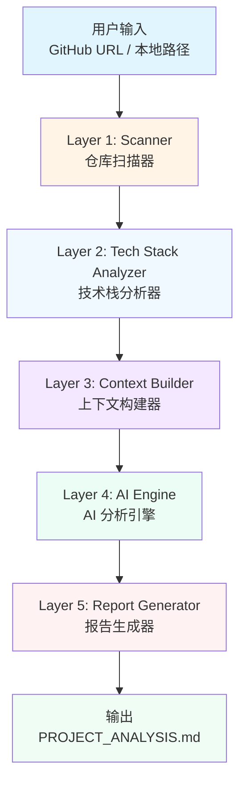
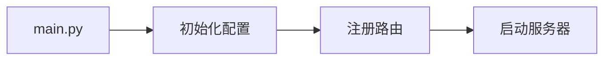
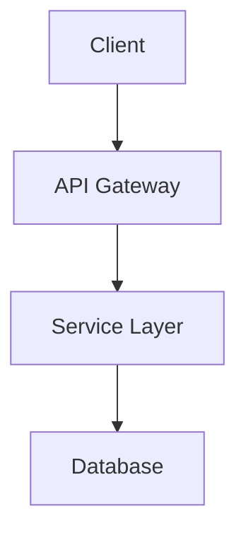

# AI GitHub Project Analyzer

<div align="center">

[](https://www.python.org/)
[](LICENSE)
[](https://typer.tiangolo.com/)
[](https://rich.readthedocs.io/)

**企业级 AI 驱动的 GitHub 项目分析器**

快速理解任意代码仓库的技术栈、架构设计和核心逻辑

</div>

---

## 📋 目录

- [✨ 特性](#-特性)
- [🎯 解决什么问题](#-解决什么问题)
- [🏗️ 系统架构](#️-系统架构)
- [🚀 快速开始](#-快速开始)
- [📖 使用指南](#-使用指南)
- [⚙️ 配置说明](#️-配置说明)
- [📊 输出示例](#-输出示例)
- [🛠️ 技术栈](#️-技术栈)
- [📁 项目结构](#-项目结构)
- [🤝 贡献指南](#-贡献指南)
- [📄 许可证](#-许可证)

---

## ✨ 特性

### 🔍 智能分析能力

- **自动技术栈检测**: 基于规则驱动的技术识别，支持 Python、Node.js、Java、Go 等主流语言
- **深度上下文构建**: 智能文件选择、优先级排序和裁剪，确保 LLM 获得最佳输入
- **8 维度 AI 分析**: 技术栈、目录结构、核心模块、启动流程、配置说明、风险分析、架构图、学习路径
- **企业级报告生成**: 自动生成包含 Mermaid 图表的 Markdown 分析报告

### 🎨 用户体验

- **CLI Dashboard**: 实时进度显示，清晰的任务状态跟踪
- **丰富的可视化**: Rich 终端渲染，彩色输出和表格展示
- **缓存管理**: 智能仓库缓存策略，避免重复克隆
- **失败容错**: 单任务失败不影响整体流程

### 🛡️ 安全可靠

- **无代码执行**: 仅静态分析，不运行目标仓库代码
- **安全文件读取**: UTF-8 编码处理，二进制文件过滤
- **Token 预算控制**: 智能裁剪大文件，避免超出 LLM 限制
- **API Key 隔离**: 环境变量管理，敏感信息安全保护

---

## 🎯 解决什么问题

### 传统代码审查痛点

❌ 手动阅读大量代码耗时  
❌ 缺乏系统性分析方法  
❌ 难以识别关键文件和核心逻辑  
❌ 缺少可视化的架构图  
❌ 新项目上手成本高  

### 本系统的价值

✅ **降低学习成本**: 快速理解陌生项目的技术栈和架构  
✅ **自动化文档**: 生成结构化的项目分析报告  
✅ **风险识别**: 自动发现潜在的技术债务和安全问题  
✅ **学习路径推荐**: 为新开发者提供上手指南  
✅ **团队协作**: 统一的项目理解标准  

---

## 🏗️ 系统架构

### Five-Layer Pipeline Architecture



### 五层架构详解

#### Layer 1: Scanner (仓库扫描器)
- **职责**: 统一解析本地路径或 GitHub URL，克隆并扫描仓库
- **核心模块**: `RepoResolver`, `GitHubCloner`, `LocalScanner`, `FileScanner`
- **输出**: `RepositorySnapshot` (文件和目录元数据)

#### Layer 2: Tech Stack Analyzer (技术栈分析器)
- **职责**: 基于规则驱动的技术栈检测，无需 LLM
- **核心模块**: `Detector`, `Rules`, 多语言解析器 (Python/Node/Java/Go)
- **输出**: `ProjectTechStack` (语言、框架、库、工具等)

#### Layer 3: Context Builder (上下文构建器)
- **职责**: 智能选择关键文件，排序优先级，裁剪大文件
- **核心模块**: `ContextSelector`, `ContextPrioritizer`, `ContextFileReader`, `ContextTruncator`
- **输出**: `AIContext` (精选的文件内容和元数据)

#### Layer 4: AI Engine (AI 分析引擎) ⭐ 核心
- **职责**: 通过 8 个专业化 Task 进行深度 AI 分析
- **核心模块**: `AIOrchestrator`, `DAGScheduler`, `LLMClient`, 8 个 Task Executor
- **Task 列表**:
  1. `tech_stack` - 技术栈深度分析
  2. `directory_structure` - 目录结构说明
  3. `core_modules` - 核心模块职责
  4. `startup_flow` - 启动流程分析
  5. `config_analysis` - 配置说明
  6. `risks` - 风险点识别
  7. `architecture_diagram` - Mermaid 架构图
  8. `learning_path` - 学习路径推荐
- **输出**: `AnalysisResult` (8 个章节的结构化结果)

#### Layer 5: Report Generator (报告生成器)
- **职责**: 将分析结果格式化为 Markdown 报告
- **核心模块**: `MarkdownReportGenerator`, `ReportTemplate`, `ReportValidator`
- **输出**: `PROJECT_ANALYSIS.md` (包含 Mermaid 图表的完整报告)

---

## 🚀 快速开始

### 前置要求

- **Python 3.12+**
- **Git** (用于克隆仓库)
- **OpenRouter API Key** (或其他兼容 OpenAI API 的提供商)

### 安装步骤

#### 1. 克隆项目

```bash
git clone https://github.com/your-username/AI-GitHub-Project-Analyzer.git
cd AI-GitHub-Project-Analyzer/ai-github-analyzer
```

#### 2. 创建虚拟环境（推荐）

```bash
# Windows PowerShell
python -m venv .venv
.\.venv\Scripts\Activate.ps1

# Linux/Mac
python -m venv .venv
source .venv/bin/activate
```

#### 3. 安装依赖

```bash
pip install -e .
```

或使用开发模式：

```bash
pip install -e ".[dev]"
```

#### 4. 配置环境变量

复制示例配置文件：

```bash
cp .env.example .env
```

编辑 `.env` 文件，填入你的 API 密钥：

```env
# AI Provider Configuration
AI_PROVIDER=openrouter
AI_MODEL=qwen/qwen3-coder:free
AI_API_KEY=your-openrouter-api-key
AI_BASE_URL=https://openrouter.ai/api/v1

# Repository Cache Settings
REPO_CLEANUP_MODE=reuse  # keep/delete/reuse/ask
```

**支持的 LLM 提供商**:
- OpenRouter (推荐，支持免费模型)
- OpenAI
- 其他兼容 OpenAI API 的服务

**推荐的免费模型**:
- `qwen/qwen3-coder:free` (推荐)
- `mistral-7b-instruct:free`

#### 5. 验证安装

```bash
python main.py version
```

预期输出：

```
AI GitHub Analyzer v0.1.0
```

---

## 📖 使用指南

### 基本用法

#### 分析 GitHub 仓库

```bash
python main.py analyze https://github.com/user/repo-name
```

#### 分析本地仓库

```bash
python main.py analyze /path/to/local/repo
```

### 高级选项

```bash
# 指定输出格式（目前仅支持 markdown）
python main.py analyze <repo_url> --format markdown

# 启用详细日志输出
python main.py analyze <repo_url> --verbose

# 查看帮助
python main.py --help
python main.py analyze --help
```

### 实际示例

#### 示例 1: 分析 FastAPI 项目

```bash
python main.py analyze https://github.com/tiangolo/fastapi
```

#### 示例 2: 分析本地 Python 项目

```bash
python main.py analyze ./my-python-project
```

### 分析流程

执行分析命令后，系统将按以下阶段运行：

```
Phase 1: 扫描仓库 ──────────────── ✓ 完成 (2.5s)
Phase 2: 技术栈分析 ────────────── ✓ 完成 (0.8s)
Phase 3: 上下文构建 ───────────── ✓ 完成 (1.2s)
Phase 4: AI 分析 ───────────────── ✓ 完成 (45.3s)
  ├─ Task 1: tech_stack
  ├─ Task 2: directory_structure
  ├─ Task 3: core_modules
  ├─ Task 4: startup_flow
  ├─ Task 5: config_analysis
  ├─ Task 6: risks
  ├─ Task 7: architecture_diagram
  └─ Task 8: learning_path
Phase 5: 报告生成 ──────────────── ✓ 完成 (0.3s)

🎉 全链路分析成功完成！总耗时: 50.1秒
📄 报告已生成: reports/<repo-name>/PROJECT_ANALYSIS.md
```

---

## ⚙️ 配置说明

### 环境变量配置

| 变量名 | 说明 | 默认值 | 示例 |
|--------|------|--------|------|
| `AI_PROVIDER` | LLM 提供商 | - | `openrouter` |
| `AI_MODEL` | 使用的模型 | - | `qwen/qwen3-coder:free` |
| `AI_API_KEY` | API 密钥 | - | `sk-or-v1-...` |
| `AI_BASE_URL` | API 基础 URL | - | `https://openrouter.ai/api/v1` |
| `LOG_LEVEL` | 日志级别 | `INFO` | `DEBUG` / `INFO` / `WARNING` |
| `REPO_CLEANUP_MODE` | 仓库缓存模式 | `reuse` | `keep` / `delete` / `reuse` / `ask` |
| `MAX_REPO_SIZE_MB` | 最大仓库大小 | `100` | `50` / `200` |
| `AGENT_TIMEOUT` | Agent 超时时间(秒) | `180` | `120` / `300` |
| `AGENT_MAX_RETRIES` | 最大重试次数 | `2` | `1` / `3` |

### 仓库缓存模式

- **`keep`**: 永久保留克隆的仓库（适合频繁分析同一项目）
- **`delete`**: 分析完成后立即删除（节省磁盘空间）
- **`reuse`**: **(推荐)** 如果仓库已存在则复用，否则克隆
- **`ask`**: 运行时询问用户是否保留

### Prompt 模板自定义

Prompt 模板位于 `prompts/` 目录，你可以根据需要修改：

```
prompts/
├── system_prompt.md          # 系统提示词
├── tech_stack.md             # 技术栈分析 Prompt
├── directory_structure.md    # 目录结构分析 Prompt
├── core_modules.md           # 核心模块分析 Prompt
├── startup_flow.md           # 启动流程分析 Prompt
├── config_analysis.md        # 配置分析 Prompt
├── risks.md                  # 风险分析 Prompt
├── architecture_diagram.md   # 架构图生成 Prompt
└── learning_path.md          # 学习路径生成 Prompt
```

---

## 📊 输出示例

### 生成的报告结构

```markdown
# <repo-name> - 项目分析报告

> **生成时间**: 2026-05-15 14:30:00  
> **分析工具**: AI GitHub Project Analyzer  
> **架构风格**: Harness Engineering

---

## 一、技术栈分析

**编程语言**: Python, JavaScript  
**框架**: FastAPI, React  
**类库**: pydantic, typer, rich  
**构建工具**: pip, npm  
**数据库**: PostgreSQL  
**容器化**: Docker  
**识别置信度**: 95%

---

## 二、项目目录说明

该项目采用标准的分层架构设计...

```
project/
├── src/              # 源代码
│   ├── api/         # API 层
│   ├── core/        # 核心业务逻辑
│   └── utils/       # 工具函数
├── tests/           # 测试代码
├── docs/            # 文档
└── docker/          # Docker 配置
```

---

## 三、核心模块职责

### 1. API 层 (src/api/)
负责 HTTP 请求处理和路由分发...

### 2. 核心业务层 (src/core/)
实现主要业务逻辑...

---

## 四、启动流程



---

## 五、配置说明

### 环境变量
- `DATABASE_URL`: 数据库连接字符串
- `API_KEY`: API 密钥

### 配置文件
- `.env`: 环境变量配置
- `pyproject.toml`: 项目配置

---

## 六、风险分析

### 安全风险
- ⚠️ API Key 明文存储在 .env 文件中
- ⚠️ 缺少输入验证

### 性能风险
- ⚠️ 数据库查询未优化
- ⚠️ 缺少缓存机制

### 维护性风险
- ⚠️ 单元测试覆盖率低
- ⚠️ 部分模块缺少文档

---

## 七、架构图



---

## 八、学习路线

### 建议阅读顺序
1. README.md - 了解项目概述
2. src/core/ - 理解核心业务逻辑
3. src/api/ - 掌握 API 设计
4. tests/ - 学习测试实践

### 详细学习步骤

#### 步骤 1: 项目概览
阅读 README.md 和架构文档...

#### 步骤 2: 核心模块
深入研究 src/core/ 目录...

**总预计耗时**: 8-12 小时
```

### CLI 输出示例

```
╭──────────────────────────────────────────────╮
│ Phase 1: 扫描仓库                             │
╰──────────────────────────────────────────────╯

✓ 仓库扫描完成！

仓库名称： fastapi
仓库路径： E:\code\temp_repos\fastapi

📁 仓库根目录概览

┌────────────────────┬──────────┬──────────────┬──────────┐
│ 名称               │ 类型     │ 后缀/技术信号│ 大小     │
├────────────────────┼──────────┼──────────────┼──────────┤
│ 📁 .github/        │ 目录     │              │ 125.3 KB │
│ 📁 docs/           │ 目录     │              │ 2.1 MB   │
│ 📁 fastapi/        │ 目录     │              │ 1.8 MB   │
│ 📁 tests/          │ 目录     │              │ 856.2 KB │
│ LICENSE            │ 许可证   │              │ 1.1 KB   │
│ README.md          │ 项目说明 │              │ 15.2 KB  │
│ pyproject.toml     │ 构建配置 │ Python       │ 3.8 KB   │
│ requirements.txt   │ 依赖文件 │ Python       │ 2.1 KB   │
└────────────────────┴──────────┴──────────────┴──────────┘

✨ 技术栈分析结果

╭──────────────────────────────────────────────╮
│ 技术栈详情                                    │
├──────────────────────────────────────────────┤
│ 编程语言： Python                            │
│ 框架： FastAPI, Pydantic                     │
│ 类库： starlette, uvicorn, httpx             │
│ 构建工具： pip                               │
│ 测试工具： pytest                            │
│                                              │
│ 识别可信度： 95%                             │
╰──────────────────────────────────────────────╯
```

---

## 🛠️ 技术栈

### 核心技术

- **语言**: Python 3.12+
- **CLI 框架**: [Typer](https://typer.tiangolo.com/) - 现代化的命令行应用框架
- **终端渲染**: [Rich](https://rich.readthedocs.io/) - 富文本和美观的终端输出
- **数据验证**: [Pydantic](https://docs.pydantic.dev/) - 数据验证和设置管理
- **日志系统**: [Loguru](https://loguru.readthedocs.io/) - 优雅的日志记录
- **LLM 集成**: OpenAI SDK + OpenRouter API
- **异步支持**: asyncio (用于仓库扫描)

### 依赖清单

```toml
# pyproject.toml
dependencies = [
    "typer>=0.9.0",
    "rich>=13.7.0",
    "loguru>=0.7.0",
    "pydantic>=2.5.0",
    "pydantic-settings>=2.1.0",
    "openai>=2.0.0",
    "python-dotenv>=1.0.0",
]

[project.optional-dependencies]
dev = [
    "pytest>=7.4.0",
    "pytest-asyncio>=0.21.0",
    "black>=23.0.0",
    "ruff>=0.1.0",
    "mypy>=1.7.0",
]
```

### 代码规模

- **核心代码**: ~5000 行 Python
- **Prompt 模板**: 9 个 .md 文件
- **任务数**: 8 个 Task Executor
- **模型数**: ~15 个 Pydantic 模型

---

## 📁 项目结构

```
AI-GitHub-Project-Analyzer/
├── ai-github-analyzer/           # 主项目目录
│   ├── src/                      # 源代码
│   │   ├── scanner/              # Layer 1: 仓库扫描器
│   │   ├── analyzer/             # Layer 2: 技术栈分析器
│   │   ├── context_builder/      # Layer 3: 上下文构建器
│   │   ├── ai_engine/            # Layer 4: AI 分析引擎
│   │   ├── report/               # Layer 5: 报告生成器
│   │   ├── models/               # 数据模型层
│   │   ├── ui/                   # UI 层 (CLI Dashboard)
│   │   └── utils/                # 通用工具
│   ├── prompts/                  # Prompt 模板 (9 个 .md 文件)
│   ├── reports/                  # 分析报告输出目录
│   ├── temp_repos/               # 临时克隆仓库目录
│   ├── logs/                     # 日志文件
│   ├── main.py                   # CLI 入口点
│   ├── pyproject.toml            # 项目配置和依赖
│   ├── .env.example              # 环境变量示例
│   └── ARCHITECTURE.md           # 系统架构文档
├── 文档/                         # 项目文档
│   ├── QUICKSTART.md             # 快速开始指南
│   ├── ENVIRONMENT_SETUP.md      # 环境配置指南
│   └── PROJECT_SUMMARY.md        # 项目总结
└── README.md                     # 本文档
```

---

## 🤝 贡献指南

我们欢迎所有形式的贡献！无论是 bug 修复、功能增强还是文档改进。

### 开发环境设置

1. **Fork 项目**

2. **克隆你的 Fork**
   ```bash
   git clone https://github.com/your-username/AI-GitHub-Project-Analyzer.git
   cd AI-GitHub-Project-Analyzer/ai-github-analyzer
   ```

3. **安装开发依赖**
   ```bash
   pip install -e ".[dev]"
   ```

4. **创建分支**
   ```bash
   git checkout -b feature/your-feature-name
   ```

5. **代码规范**
   ```bash
   # 格式化代码
   black src/
   
   # 代码检查
   ruff check src/
   
   # 类型检查
   mypy src/
   ```

6. **运行测试**
   ```bash
   pytest tests/
   ```

7. **提交更改**
   ```bash
   git add .
   git commit -m "feat: add your feature description"
   git push origin feature/your-feature-name
   ```

8. **创建 Pull Request**

### 贡献原则

- ✅ 遵循 PEP 8 代码规范
- ✅ 添加必要的单元测试
- ✅ 更新相关文档
- ✅ 保持向后兼容性
- ❌ 不要提交 `.env` 文件
- ❌ 不要硬编码 API 密钥

---

## 📄 许可证

本项目采用 MIT 许可证 - 详见 [LICENSE](LICENSE) 文件

---

## 🙏 致谢

- [OpenRouter](https://openrouter.ai/) - 提供免费的 LLM 访问
- [Qwen](https://tongyi.aliyun.com/qianwen/) - 优秀的代码理解模型
- [Typer](https://typer.tiangolo.com/) - 简洁的 CLI 框架
- [Rich](https://rich.readthedocs.io/) - 美丽的终端渲染

---

## 📞 联系方式

- **Issues**: [GitHub Issues](https://github.com/your-username/AI-GitHub-Project-Analyzer/issues)
- **Discussions**: [GitHub Discussions](https://github.com/your-username/AI-GitHub-Project-Analyzer/discussions)

---

<div align="center">

**Made with ❤️ by AI GitHub Project Analyzer Team**

[⭐ Star this project](https://github.com/your-username/AI-GitHub-Project-Analyzer)

</div>