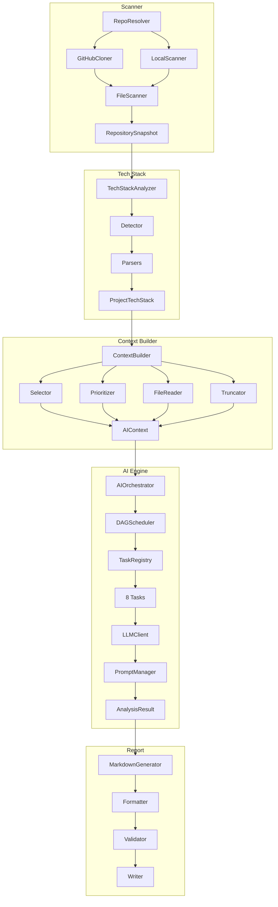
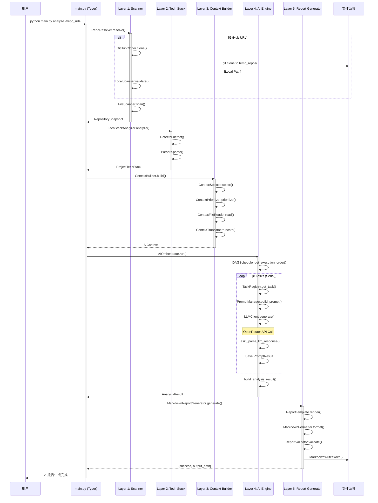
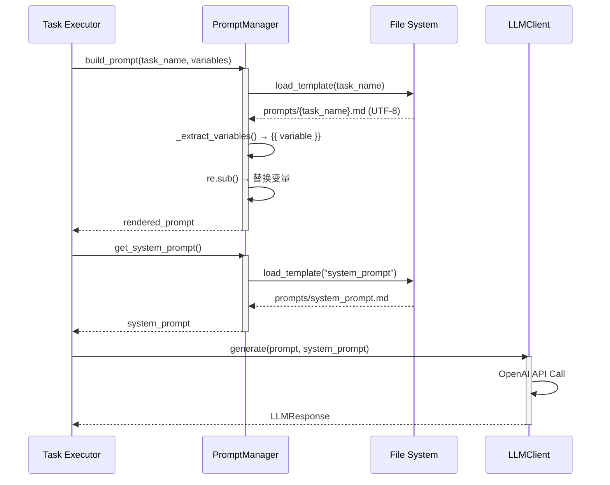
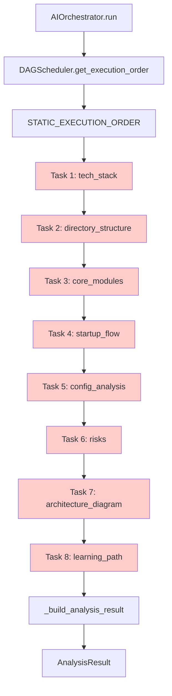
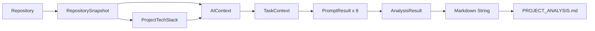
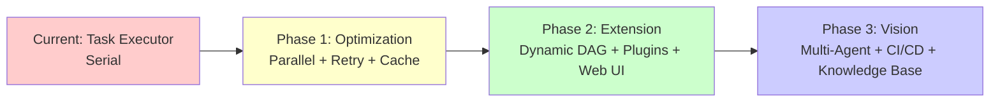

# AI GitHub Project Analyzer - 系统架构文档

**文档版本**: v2.0  
**生成时间**: 2026-05-15  
**分析对象**: AI-GitHub-Project-Analyzer (当前代码库)  
**架构风格**: Five-Layer Pipeline Architecture (Harness-inspired)

---

## 1. System Overview

### 系统目标

AI GitHub Project Analyzer 是一个基于 LLM 的自动化代码仓库分析工具，能够：

1. **自动扫描**本地或 GitHub 仓库
2. **规则驱动**的技术栈检测
3. **智能上下文构建**（文件选择、优先级排序、裁剪）
4. **AI 深度分析**（8 个专业化任务）
5. **生成企业级分析报告**（Markdown + Mermaid）

### 核心价值

- **降低学习成本**：快速理解陌生项目的技术栈和架构
- **自动化文档**：生成结构化的项目分析报告
- **风险识别**：自动发现潜在的技术债务和安全问题
- **学习路径推荐**：为新开发者提供上手指南

### 解决什么问题

传统代码审查和学习新项目的痛点：
- ❌ 手动阅读大量代码耗时
- ❌ 缺乏系统性分析方法
- ❌ 难以识别关键文件和核心逻辑
- ❌ 缺少可视化的架构图

本系统通过 **Pipeline Architecture** 自动化整个分析流程。

### 系统边界

**输入**：
- 本地路径 (`/path/to/repo`)
- GitHub URL (`https://github.com/user/repo`)

**输出**：
- `PROJECT_ANALYSIS.md`（包含 8 个章节的分析报告）

**不包含**：
- ❌ 代码执行（安全隔离）
- ❌ 实时监控系统
- ❌ CI/CD 集成（未来规划）
- ❌ Web UI（仅 CLI）

---

## 2. Architecture Style

### 为什么是 Five-Layer Pipeline Architecture？

当前系统属于 **Five-Layer Pipeline Architecture**，而不是 Multi-Agent Architecture。

**原因**：

1. **串行执行模型**：8 个 Task 按预定义顺序串行执行，无并行
2. **无 Agent 自主性**：Task 是被动执行器（Executor），不是主动决策者（Agent）
3. **静态 DAG**：依赖图是硬编码的，不支持动态调度
4. **无状态传递**：Task 之间不共享中间状态，仅通过 Orchestrator 聚合结果

**与 Harness Engineering 的关系**：

当前系统是 **Harness-inspired**（受启发），而不是完整 Harness Engineering 系统：

| 特性 | Harness Engineering | 当前系统 |
|------|-------------------|---------|
| 并行执行 | ✅ 支持 | ❌ 未实现 |
| 动态依赖图 | ✅ 支持 | ❌ 静态 DAG |
| Agent 自主性 | ✅ 多 Agent 协作 | ❌ Task Executor |
| 重试机制 | ✅ 内置 | ❌ 未集成 |
| 质量检查 | ✅ 自动化 | ❌ 未集成 |
| 缓存机制 | ✅ Prompt 缓存 | ❌ 无缓存 |

**架构演进路线**：
```
Current: Task Executor Pattern (Serial)
    ↓
Next: Parallel Task Groups (Partial Parallelism)
    ↓
Future: Multi-Agent System (Full Harness Engineering)
```

### Five-Layer Pipeline 架构



**各层职责**：

| Layer | 名称 | 职责 | 输出 |
|-------|------|------|------|
| 1 | Scanner | 仓库扫描（本地/GitHub） | RepositorySnapshot |
| 2 | Tech Stack Analysis | 规则驱动的技术检测 | ProjectTechStack |
| 3 | Context Builder | 上下文构建（筛选、排序、裁剪） | AIContext |
| 4 | AI Engine | LLM 驱动的深度分析 | AnalysisResult |
| 5 | Report Generator | Markdown 报告生成 | PROJECT_ANALYSIS.md |

---

## 3. End-to-End Execution Flow

从 Repository 到 PROJECT_ANALYSIS.md 的完整执行链：



**执行时间估算**：
- Layer 1-3: ~5-10 秒（I/O 密集型）
- Layer 4: ~60-120 秒（8 次 LLM 调用，每次 7-15 秒）
- Layer 5: ~1-2 秒（文件写入）
- **总计**: ~66-132 秒

---

## 4. Layer Design

## Layer 1 — Scanner

### 职责

统一解析仓库入口（本地路径或 GitHub URL），克隆/扫描文件系统，生成结构化快照。

### 核心模块

| 模块 | 文件 | 职责 |
|------|------|------|
| RepoResolver | `scanner/repo_resolver.py` | 统一入口，区分本地/GitHub |
| GitHubCloner | `scanner/github_cloner.py` | git clone 到 temp_repos/ |
| LocalScanner | `scanner/local_scanner.py` | 验证本地路径合法性 |
| FileScanner | `scanner/file_scanner.py` | 遍历文件系统，生成元数据 |
| RepoCacheManager | `scanner/repo_cache_manager.py` | 缓存管理（保留/清理策略） |

### 输入输出

```python
# 输入
repo_url: str  # "https://github.com/user/repo" 或 "/path/to/repo"

# 输出
RepositorySnapshot(
    repo_name="my-repo",
    repo_path=Path("/tmp/temp_repos/my-repo"),
    files=[FileMetadata(...), ...],
    directories=[DirectoryMetadata(...), ...]
)
```

### 边界

- ✅ 支持本地绝对/相对路径
- ✅ 支持 GitHub HTTPS URL
- ❌ 不支持 GitLab/Bitbucket（未来扩展）
- ❌ 不支持私有仓库认证（需配置 SSH key）

### 限制

- 最大文件大小：无限制（但 Context Builder 会裁剪）
- 忽略目录：`.git`, `node_modules`, `__pycache__`, `.venv`
- 克隆超时：默认 60 秒（可配置）

### 实现状态

**Implemented** ✅

---

## Layer 2 — Tech Stack Analysis

### 职责

基于规则的静态分析，检测编程语言、框架、库、配置文件。

### 核心模块

| 模块 | 文件 | 职责 |
|------|------|------|
| TechStackAnalyzer | `analyzer/tech_stack/analyzer.py` | 总协调器 |
| Detector | `analyzer/tech_stack/detector.py` | 基于文件后缀/文件名检测 |
| Rules | `analyzer/tech_stack/rules.py` | 技术信号映射表 |
| PythonParser | `analyzer/tech_stack/parsers/python_parser.py` | 解析 requirements.txt/pyproject.toml |
| NodeParser | `analyzer/tech_stack/parsers/node_parser.py` | 解析 package.json |
| JavaParser | `analyzer/tech_stack/parsers/java_parser.py` | 解析 pom.xml/build.gradle |
| GoParser | `analyzer/tech_stack/parsers/go_parser.py` | 解析 go.mod |

### 输入输出

```python
# 输入
RepositorySnapshot

# 输出
ProjectTechStack(
    languages=["Python", "JavaScript"],
    frameworks=["FastAPI", "React"],
    libraries=["pydantic", "typer"],
    databases=["PostgreSQL"],
    dev_tools=["pytest", "black"]
)
```

### 检测规则示例

```python
# rules.py
TECH_SIGNALS = {
    "package.json": {"language": "JavaScript", "type": "config"},
    "requirements.txt": {"language": "Python", "type": "dependencies"},
    "pom.xml": {"language": "Java", "type": "build"},
    ".py": {"language": "Python", "type": "source"},
    "Dockerfile": {"category": "devops", "type": "container"},
}
```

### 边界

- ✅ 规则驱动，无需 LLM
- ✅ 支持 4 种语言解析器（Python/Node/Java/Go）
- ❌ 不支持自定义规则扩展（未来规划）
- ❌ 置信度评分未实现

### 实现状态

**Implemented** ✅

---

## Layer 3 — Context Builder

### 职责

从 RepositorySnapshot 中筛选关键文件，排序优先级，安全读取内容，裁剪大文件，打包为 AIContext。

### 核心模块

| 模块 | 文件 | 职责 |
|------|------|------|
| ContextBuilder | `context_builder/builder.py` | 总编排器 |
| ContextSelector | `context_builder/selector.py` | 基于规则筛选关键文件 |
| ContextPrioritizer | `context_builder/prioritizer.py` | S/A/B/C 四级优先级排序 |
| ContextFileReader | `context_builder/file_reader.py` | 安全读取（UTF-8，最大 500KB） |
| ContextTruncator | `context_builder/truncator.py` | Token 预算控制，大文件裁剪 |
| Rules | `context_builder/rules.py` | 入口文件模式规则 |

### 输入输出

```python
# 输入
RepositorySnapshot + ProjectTechStack

# 输出
AIContext(
    repo_name="my-repo",
    repo_path=Path(...),
    files=[ContextFile(...), ...],  # 最多 50 个文件
    directories=[DirectoryContext(...), ...],
    tech_stack=TechStackContext(...),
    token_budget=50000
)
```

### 优先级规则

| 级别 | 文件类型 | 示例 |
|------|---------|------|
| S | 核心文档/配置 | README.md, Dockerfile, docker-compose.yml |
| A | 入口文件 | main.py, app.py, index.js, server.go |
| B | 配置文件 | pyproject.toml, package.json, .env.example |
| C | 关键源码 | routers/*.py, models/*.py, services/*.py |

### 裁剪策略

- Token 预算：50,000 tokens
- 单文件上限：500 KB
- 二进制文件过滤：跳过 `.png`, `.jpg`, `.exe` 等
- 编码检测：强制 UTF-8，失败则跳过

### 边界

- ✅ 防止 LLM context overflow
- ✅ 安全读取（异常处理）
- ❌ 无语义分析（仅基于文件名/路径）
- ❌ 无跨文件依赖分析

### 实现状态

**Implemented** ✅

---

## Layer 4 — AI Engine ⭐

### 职责

基于 LLM 的深度分析，执行 8 个专业化任务，生成结构化分析结果。

### 核心模块

#### 1. AIOrchestrator (`ai_engine/orchestrator.py`)

**职责**：总调度器，串行执行 8 个任务，聚合结果。

**关键方法**：
```python
def run(ai_context: AIContext) -> AnalysisResult:
    execution_order = DAGScheduler.get_execution_order()
    
    for task_name in execution_order:
        result = self._execute_single_task(task_name, context)
        self._prompt_results[task_name] = result
    
    return self._build_analysis_result()
```

**特性**：
- ✅ 失败继续：单任务失败不中断流程
- ✅ 日志记录：每个任务开始/成功/失败/耗时
- ❌ 无并行：当前串行执行
- ❌ 无重试：retry_handler.py 存在但未集成

---

#### 2. DAGScheduler (`ai_engine/dag.py`)

**职责**：任务顺序管理（当前静态）。

**当前实现**：
```python
STATIC_EXECUTION_ORDER = [
    "tech_stack",           # 1
    "directory_structure",  # 2
    "core_modules",         # 3
    "startup_flow",         # 4
    "config_analysis",      # 5
    "risks",                # 6
    "architecture_diagram", # 7
    "learning_path",        # 8
]
```

**预留接口**：
```python
def get_parallel_groups(self) -> List[List[str]]:
    # 当前：每组一个任务（串行）
    # 未来：返回可并行的任务组
    return [[task] for task in self._execution_order]
```

**实现状态**：**Partially Implemented** ⚠️

---

#### 3. TaskRegistry (`ai_engine/registry.py`)

**职责**：任务注册中心（字典映射）。

```python
TASK_REGISTRY = {
    "tech_stack": TechStackTask,
    "directory_structure": DirectoryTask,
    "core_modules": CoreModulesTask,
    "startup_flow": StartupTask,
    "config_analysis": ConfigTask,
    "risks": RisksTask,
    "architecture_diagram": ArchitectureTask,
    "learning_path": LearningPathTask,
}
```

**实现状态**：**Implemented** ✅

---

#### 4. BaseTask (`ai_engine/tasks/base.py`)

**职责**：任务基类，提供模板方法。

**模板方法**：
```python
def execute_with_llm(self, context: TaskContext) -> PromptResult:
    # Step 1: 构建 Prompt
    variables = self._prepare_prompt_variables(context)
    prompt = prompt_manager.build_prompt(self.name, variables)
    
    # DEBUG: 打印 Prompt
    print(f"[PROMPT] {self.name}")
    print(f"Prompt length: {len(prompt)} characters")
    
    # Step 2: 调用 LLM
    system_prompt = prompt_manager.get_system_prompt()
    llm_response = llm_client.generate(
        prompt=prompt,
        system_prompt=system_prompt,
        temperature=0.7,
        max_tokens=4000
    )
    
    # DEBUG: 打印 LLM 响应
    print(f"[LLM RESPONSE] {self.name}")
    print(f"Success: {llm_response.success}")
    
    # Step 3: 解析响应
    parsed_result = self._parse_llm_response(llm_response.content, context)
    
    # Step 4: 验证结果
    self.validate_result(parsed_result)
    
    return PromptResult(...)
```

**抽象方法**（子类必须实现）：
- `execute()` - 任务执行逻辑
- `get_prompt_template()` - Prompt 模板名称
- `_parse_llm_response()` - 解析 LLM 响应
- `validate_result()` - 结果验证

**实现状态**：**Implemented** ✅

---

#### 5. 8 个 Task Executor

| Task | 文件 | Prompt 模板 | 实现状态 |
|------|------|------------|---------|
| TechStackTask | `tasks/tech_stack_task.py` | `prompts/tech_stack.md` | ⚠️ Partially |
| DirectoryTask | `tasks/directory_task.py` | `prompts/directory_structure.md` | ⚠️ Partially |
| CoreModulesTask | `tasks/core_modules_task.py` | `prompts/core_modules.md` | ⚠️ Partially |
| StartupTask | `tasks/startup_task.py` | `prompts/startup_flow.md` | ⚠️ Partially |
| ConfigTask | `tasks/config_task.py` | `prompts/config_analysis.md` | ⚠️ Partially |
| RisksTask | `tasks/risks_task.py` | `prompts/risks.md` | ⚠️ Partially |
| ArchitectureTask | `tasks/architecture_task.py` | `prompts/architecture_diagram.md` | ⚠️ Partially |
| LearningPathTask | `tasks/learning_path_task.py` | `prompts/learning_path.md` | ⚠️ Partially |

**共同问题**：
- ✅ 都继承 BaseTask，遵循模板方法模式
- ✅ 都有对应的 Prompt 模板
- ❌ `_parse_llm_response()` 大多是占位实现
- ❌ 大部分返回空对象或简单截取，未充分解析 LLM 响应

**示例**（TechStackTask）：
```python
def _parse_llm_response(self, content: str, context: TaskContext) -> TechStackAnalysis:
    # TODO: 实际解析 JSON
    try:
        data = json.loads(content)
        return TechStackAnalysis(**data)
    except:
        # 降级：返回空对象
        return TechStackAnalysis(languages=[], frameworks=[])
```

---

#### 6. PromptManager (`ai_engine/prompt_manager.py`)

**职责**：Prompt 模板管理，变量注入。

**关键方法**：
```python
def load_template(task_name: str) -> str:
    """加载 prompts/{task_name}.md (UTF-8)"""
    
def build_prompt(task_name: str, variables: dict) -> str:
    """变量注入：{{ variable }} → value"""
    template = self.load_template(task_name)
    return re.sub(r"\{\{(\w+)\}\}", lambda m: variables.get(m.group(1), ""), template)

def get_system_prompt() -> str:
    """加载 prompts/system_prompt.md"""
```

**变量注入机制**：
```python
variables = {
    "repo_name": context.ai_context.repo_name,
    "directory_tree": str(context.ai_context.directory_tree),
    "key_files": '\n'.join(context.ai_context.key_files),
    "detected_tech_stack": str(context.ai_context.tech_stack),
    "sampled_code": str(context.ai_context.sampled_code)[:5000],
    "context": str(context.ai_context),
}
```

**实现状态**：**Implemented** ✅

---

#### 7. LLMClient (`ai_engine/llm_client.py`)

**职责**：LLM 调用（OpenRouter/Qwen）。

**配置**：
```python
def __init__(self):
    self.provider = os.getenv("AI_PROVIDER") or "openai_compatible"
    self.model = os.getenv("AI_MODEL") or "qwen/qwen3-coder:free"
    self.api_key = os.getenv("AI_API_KEY") or ""
    self.base_url = os.getenv("AI_BASE_URL") or "https://openrouter.ai/api/v1"
    
    self.client = OpenAI(
        api_key=self.api_key,
        base_url=self.base_url
    )
```

**环境变量** (`.env`)：
```env
AI_PROVIDER=openai_compatible
AI_MODEL=qwen/qwen3-coder:free
AI_API_KEY=sk-or-v1-...
AI_BASE_URL=https://openrouter.ai/api/v1
AGENT_TIMEOUT=60
```

**调用示例**：
```python
def generate(prompt: str, system_prompt: str, temperature: float = 0.7, max_tokens: int = 4000) -> LLMResponse:
    response = self.client.chat.completions.create(
        model=self.model,
        messages=[
            {"role": "system", "content": system_prompt},
            {"role": "user", "content": prompt}
        ],
        temperature=temperature,
        max_tokens=max_tokens
    )
    
    return LLMResponse(
        success=True,
        content=response.choices[0].message.content,
        token_usage={
            "prompt_tokens": response.usage.prompt_tokens,
            "completion_tokens": response.usage.completion_tokens,
            "total_tokens": response.usage.total_tokens
        }
    )
```

**实现状态**：**Implemented** ✅

---

### Task Execution Architecture

**当前执行模式**：Task Executor Pattern（串行）

```mermaid
graph LR
    A[AIOrchestrator] --> B[DAGScheduler]
    B --> C[Static Order]
    C --> D[Task 1: tech_stack]
    D --> E[Task 2: directory_structure]
    E --> F[Task 3: core_modules]
    F --> G[Task 4: startup_flow]
    G --> H[Task 5: config_analysis]
    H --> I[Task 6: risks]
    I --> J[Task 7: architecture_diagram]
    J --> K[Task 8: learning_path]
    K --> L[AnalysisResult]
    
    style D fill:#ffcccc
    style E fill:#ffcccc
    style F fill:#ffcccc
    style G fill:#ffcccc
    style H fill:#ffcccc
    style I fill:#ffcccc
    style J fill:#ffcccc
    style K fill:#ffcccc
```



**特点**：
- ✅ 有向无环图（DAG）结构
- ✅ 预定义静态顺序
- ❌ 无动态依赖计算
- ❌ 无并行任务组
- ❌ 依赖图未使用（`dependency_graph.py` 存在但未集成）

**实现状态**：**Partially Implemented** ⚠️

---

### 未集成的组件

| 组件 | 文件 | 用途 | 状态 |
|------|------|------|------|
| RetryHandler | `ai_engine/retry_handler.py` | LLM 调用重试 | ❌ Planned |
| QualityChecker | `ai_engine/quality_checker.py` | 结果质量检查 | ❌ Planned |
| DependencyGraph | `ai_engine/dependency_graph.py` | 动态依赖图 | ❌ Planned |

---

## Layer 5 — Report Generator

### 职责

将 AnalysisResult 格式化为 Markdown 报告，校验完整性，写入文件系统。

### 核心模块

| 模块 | 文件 | 职责 |
|------|------|------|
| MarkdownReportGenerator | `report/generator.py` | 总控制器 |
| ReportTemplate | `report/template.py` | 渲染 8 个章节 |
| MarkdownFormatter | `report/formatter.py` | Markdown 格式化 |
| ReportValidator | `report/validator.py` | 质量校验 |
| MarkdownWriter | `report/markdown_writer.py` | 文件写入 |

### 执行流程

```python
def generate(analysis_result: AnalysisResult, repo_path: Path) -> dict:
    # Step 1: 渲染模板
    rendered_content = self._render_template(analysis_result)
    
    # Step 2: 格式化 Markdown
    formatted_content = self._format_markdown(rendered_content)
    
    # Step 3: 质量校验
    validation_result = self._validate_report(formatted_content)
    
    # Step 4: 写入文件
    output_file = self._write_file(formatted_content, repo_path)
    
    return {
        "success": True,
        "output_path": output_file,
        "validation_result": validation_result
    }
```

### 报告结构

生成的 `PROJECT_ANALYSIS.md` 包含 8 个章节：

```markdown
# {repo_name} 项目分析报告

> 生成时间: {analysis_time}

---

## 一、技术栈分析
## 二、目录结构
## 三、核心模块
## 四、启动流程
## 五、配置说明
## 六、风险分析
## 七、架构图
## 八、学习路线
```

### 质量校验规则

**ReportValidator** (`report/validator.py`)：

```python
# 必需章节检查
REQUIRED_SECTIONS = [
    "一、技术栈分析",
    "二、目录结构",
    "三、核心模块",
    "四、启动流程",
    "五、配置说明",
    "六、风险分析",
    "七、架构图",
    "八、学习路线",
]

# Mermaid 检查
if "```mermaid" not in content:
    errors.append(("MISSING_MERMAID", "缺少 Mermaid 架构图"))

# 文件大小检查 (3KB ~ 30KB)
file_size_kb = len(content.encode('utf-8')) / 1024
if file_size_kb < 3 or file_size_kb > 30:
    errors.append(("FILE_SIZE", f"文件大小异常: {file_size_kb:.1f}KB"))

# 风险分析三段式检查
if "高风险" not in content or "中风险" not in content or "低风险" not in content:
    errors.append(("RISK_STRUCTURE", "风险分析缺少三段式结构"))
```

### 实现状态

**Implemented** ✅

---

## 5. Prompt System Architecture

### Prompt 组织结构

```
prompts/
├── system_prompt.md       # 系统提示词（角色定义、约束）
├── tech_stack.md          # 技术栈分析 Prompt
├── directory_structure.md # 目录结构分析 Prompt
├── core_modules.md        # 核心模块分析 Prompt
├── startup_flow.md        # 启动流程分析 Prompt
├── config_analysis.md     # 配置分析 Prompt
├── risks.md               # 风险分析 Prompt
├── architecture_diagram.md # 架构图生成 Prompt
└── learning_path.md       # 学习路径 Prompt
```

### Prompt 生命周期



### 变量注入机制

**BaseTask._prepare_prompt_variables()**：

```python
variables = {
    "repo_name": context.ai_context.repo_name,
    "directory_tree": str(context.ai_context.directory_tree),
    "key_files": '\n'.join(context.ai_context.key_files),
    "detected_tech_stack": str(context.ai_context.tech_stack),
    "sampled_code": str(context.ai_context.sampled_code)[:5000],
    "context": str(context.ai_context),
}
```

**示例** (`prompts/tech_stack.md`)：

```markdown
# 技术栈分析 Prompt

## 输入变量
- `repo_name`: {{repo_name}}
- `directory_tree`: {{directory_tree}}
- `key_files`: {{key_files}}
- `detected_tech_stack`: {{detected_tech_stack}}
- `sampled_code`: {{sampled_code}}

## 任务
请分析以下项目的技术栈...
```

### Prompt 设计原则

1. **外部化**：Prompt 与代码解耦，独立 `.md` 文件
2. **模板化**：使用 `{{ variable }}` 占位符
3. **UTF-8 编码**：支持中文 Prompt
4. **模块化**：每个 Task 一个 Prompt 文件
5. **可维护性**：易于修改和版本控制

### 实现状态

**Implemented** ✅

---

## 6. Task Execution Architecture

### 8 个 Task 执行流程

**当前实现**：Static DAG，串行执行



**执行特点**：

| 特性 | 当前实现 | 未来规划 |
|------|---------|---------|
| 执行顺序 | 静态硬编码 | 动态依赖图 |
| 并行度 | 串行（1 个/次） | 并行任务组 |
| 失败处理 | 失败继续 | 重试机制 |
| 结果缓存 | 无缓存 | Prompt 缓存 |
| 依赖计算 | 无 | 自动推导 |

### Task 依赖关系（理论）

```
tech_stack (无依赖)
    ↓
directory_structure (无依赖)
    ↓
core_modules (依赖: tech_stack, directory_structure)
    ↓
startup_flow (依赖: core_modules)
    ↓
config_analysis (依赖: tech_stack)
    ↓
risks (依赖: 所有上述任务)
    ↓
architecture_diagram (依赖: 所有上述任务)
    ↓
learning_path (依赖: 所有上述任务)
```

**当前状态**：依赖图存在但未使用（`dependency_graph.py`）

### 实现状态表格

| Capability | Status | Notes |
|-----------|--------|-------|
| Static DAG | ✅ Implemented | 硬编码顺序 |
| Serial Execution | ✅ Implemented | 8 个任务依次执行 |
| Failure Handling | ✅ Implemented | 失败继续，记录日志 |
| Task Registry | ✅ Implemented | 字典映射 |
| BaseTask Template | ✅ Implemented | 模板方法模式 |
| Prompt Management | ✅ Implemented | 外部化 + 变量注入 |
| LLM Integration | ✅ Implemented | OpenRouter + Qwen |
| Parallel Execution | ❌ Planned | `get_parallel_groups()` 返回串行 |
| Retry Mechanism | ❌ Planned | `retry_handler.py` 存在但未集成 |
| Quality Checker | ❌ Planned | `quality_checker.py` 存在但未集成 |
| Dynamic Dependency Graph | ❌ Planned | `dependency_graph.py` 存在但未使用 |
| Result Caching | ❌ Planned | 每次都调用 LLM |
| Token Calculation | ❌ Planned | `estimated_tokens=0` |
| Structured Parsing | ⚠️ Partially | 大部分 Task 是占位实现 |

---

## 7. LLM Integration

### OpenRouter + Qwen 集成

**提供商**：OpenRouter (OpenAI-compatible API)  
**模型**：`qwen/qwen3-coder:free`（免费额度）  
**SDK**：OpenAI Python SDK

### 配置方式

**环境变量** (`.env`)：

```env
AI_PROVIDER=openai_compatible
AI_MODEL=qwen/qwen3-coder:free
AI_API_KEY=sk-or-v1-xxxxxxxxxxxxx
AI_BASE_URL=https://openrouter.ai/api/v1
AGENT_TIMEOUT=60
```

### API 调用流程

```python
from openai import OpenAI

client = OpenAI(
    api_key=os.getenv("AI_API_KEY"),
    base_url=os.getenv("AI_BASE_URL")
)

response = client.chat.completions.create(
    model=os.getenv("AI_MODEL"),
    messages=[
        {"role": "system", "content": system_prompt},
        {"role": "user", "content": user_prompt}
    ],
    temperature=0.7,
    max_tokens=4000
)

content = response.choices[0].message.content
token_usage = {
    "prompt_tokens": response.usage.prompt_tokens,
    "completion_tokens": response.usage.completion_tokens,
    "total_tokens": response.usage.total_tokens
}
```

### 错误处理

**当前实现**：

```python
try:
    response = client.chat.completions.create(...)
    return LLMResponse(success=True, content=..., token_usage=...)
except Exception as e:
    logger.error(f"LLM call failed: {e}")
    return LLMResponse(success=False, error_message=str(e))
```

**限制**：
- ❌ 无重试机制
- ❌ 无指数退避
- ❌ 无超时控制（依赖 OpenAI SDK 默认值）
- ❌ 无降级策略

### Token 成本估算

**单次调用**：
- Prompt: ~5,000-10,000 tokens
- Completion: ~1,000-2,000 tokens
- 总计: ~6,000-12,000 tokens

**8 个任务**：
- 总计: ~48,000-96,000 tokens
- Qwen 免费额度：足够日常使用

### 实现状态

**Implemented** ✅

---

## 8. Data Flow

### 数据生命周期



### 关键数据模型

#### 1. RepositorySnapshot (Layer 1 输出)

```python
class RepositorySnapshot(BaseModel):
    repo_name: str
    repo_path: Path
    files: List[FileMetadata]
    directories: List[DirectoryMetadata]
```

#### 2. ProjectTechStack (Layer 2 输出)

```python
class ProjectTechStack(BaseModel):
    languages: List[str]
    frameworks: List[str]
    libraries: List[str]
    databases: List[str]
    dev_tools: List[str]
```

#### 3. AIContext (Layer 3 输出)

```python
class AIContext(BaseModel):
    repo_name: str
    repo_path: Path
    files: List[ContextFile]
    directories: List[DirectoryContext]
    tech_stack: Optional[TechStackContext]
    token_budget: int = 50000
```

#### 4. TaskContext (Layer 4 输入)

```python
class TaskContext(BaseModel):
    ai_context: AIContext
    task_config: TaskConfig
```

#### 5. PromptResult (Layer 4 中间结果)

```python
class PromptResult(BaseModel):
    task_name: str
    success: bool
    content: Optional[str]
    elapsed_time: float
    error_message: Optional[str]
```

#### 6. AnalysisResult (Layer 4 输出)

```python
class AnalysisResult(BaseModel):
    repo_name: str
    analysis_time: datetime
    tech_stack: Optional[TechStackAnalysis]
    directory_structure: Optional[DirectoryStructureAnalysis]
    core_modules: Optional[CoreModuleAnalysis]
    startup_flow: Optional[StartupFlowAnalysis]
    config_analysis: Optional[ConfigAnalysis]
    risks: Optional[RiskAnalysis]
    architecture_diagram: Optional[ArchitectureDiagram]
    learning_path: Optional[LearningPath]
    elapsed_time: float
```

### 数据流转细节

```
Phase 1: Scanner
  Repository (Git Repo)
    ↓ FileScanner.scan()
  RepositorySnapshot (files + directories)

Phase 2: Tech Stack Analyzer
  RepositorySnapshot
    ↓ TechStackAnalyzer.analyze()
  ProjectTechStack (languages + frameworks + ...)

Phase 3: Context Builder
  RepositorySnapshot + ProjectTechStack
    ↓ ContextBuilder.build()
  AIContext (files + directories + tech_stack)

Phase 4: AI Engine
  AIContext
    ↓ AIOrchestrator.run()
  TaskContext × 8
    ↓ Task.execute_with_llm()
  PromptResult × 8
    ↓ _build_analysis_result()
  AnalysisResult (8 chapters)

Phase 5: Report Generator
  AnalysisResult
    ↓ MarkdownReportGenerator.generate()
  Markdown String
    ↓ MarkdownWriter.write()
  PROJECT_ANALYSIS.md (File System)
```

### 实现状态

**Implemented** ✅

---

## 9. Implemented vs Planned

### 功能状态表格

| Capability | Status | Notes |
|-----------|--------|-------|
| **Layer 1: Scanner** | | |
| Local Path Scanning | ✅ Implemented | LocalScanner + FileScanner |
| GitHub Clone | ✅ Implemented | GitHubCloner + git clone |
| Repo Cache Manager | ✅ Implemented | 保留/清理策略 |
| GitLab/Bitbucket Support | ❌ Planned | 仅支持 GitHub |
| Private Repo Auth | ❌ Planned | 需配置 SSH key |
| **Layer 2: Tech Stack** | | |
| Rule-based Detection | ✅ Implemented | Detector + Rules |
| Python Parser | ✅ Implemented | requirements.txt/pyproject.toml |
| Node Parser | ✅ Implemented | package.json |
| Java Parser | ✅ Implemented | pom.xml/build.gradle |
| Go Parser | ✅ Implemented | go.mod |
| Custom Rules Extension | ❌ Planned | 硬编码规则 |
| Confidence Scoring | ❌ Planned | 无置信度评分 |
| **Layer 3: Context Builder** | | |
| File Selection | ✅ Implemented | ContextSelector |
| Priority Sorting (S/A/B/C) | ✅ Implemented | ContextPrioritizer |
| Safe File Reading | ✅ Implemented | UTF-8, 500KB max |
| Token Truncation | ✅ Implemented | ContextTruncator |
| Semantic Analysis | ❌ Planned | 仅基于文件名 |
| Cross-file Dependency | ❌ Planned | 无依赖分析 |
| **Layer 4: AI Engine** | | |
| AI Orchestrator | ✅ Implemented | 串行执行 8 任务 |
| Task Registry | ✅ Implemented | 字典映射 |
| BaseTask Template | ✅ Implemented | 模板方法模式 |
| Prompt Manager | ✅ Implemented | 外部化 + 变量注入 |
| LLM Client | ✅ Implemented | OpenRouter + Qwen |
| Static DAG | ✅ Implemented | 硬编码顺序 |
| Parallel Execution | ❌ Planned | `get_parallel_groups()` 返回串行 |
| Retry Mechanism | ❌ Planned | `retry_handler.py` 未集成 |
| Quality Checker | ❌ Planned | `quality_checker.py` 未集成 |
| Dynamic Dependency Graph | ❌ Planned | `dependency_graph.py` 未使用 |
| Result Caching | ❌ Planned | 每次都调用 LLM |
| Token Calculation | ❌ Planned | `estimated_tokens=0` |
| Structured Parsing | ⚠️ Partially | 大部分 Task 是占位实现 |
| **Layer 5: Report Generator** | | |
| Template Rendering | ✅ Implemented | 8 章节渲染 |
| Markdown Formatting | ✅ Implemented | 标题、列表、代码块 |
| Report Validation | ✅ Implemented | 完整性、Mermaid、文件大小 |
| File Writing | ✅ Implemented | PROJECT_ANALYSIS.md |
| Multiple Formats | ❌ Planned | 仅 Markdown |
| HTML Export | ❌ Planned | 未来扩展 |
| **UI Layer** | | |
| CLI Dashboard | ✅ Implemented | Rich Live |
| Progress Tracking | ✅ Implemented | ProgressManager |
| Terminal Rendering | ✅ Implemented | 表格、面板 |
| Web UI | ❌ Planned | 仅 CLI |
| **Infrastructure** | | |
| Logging (loguru) | ✅ Implemented | 结构化日志 |
| Configuration (dotenv) | ✅ Implemented | 环境变量 |
| Error Handling | ✅ Implemented | 异常捕获 |
| Async Support | ⚠️ Partially | 仅 Scanner 使用 asyncio |
| Testing Framework | ❌ Planned | 无单元测试 |

---

## 10. Known Limitations

### 当前系统的已知限制

#### 1. 性能限制

- **串行执行慢**：8 个任务依次执行，总耗时 60-120 秒
- **无并行优化**：`get_parallel_groups()` 返回串行
- **无结果缓存**：每次都调用 LLM，重复分析相同仓库浪费资源
- **Token 成本高**：每次分析消耗 48,000-96,000 tokens

#### 2. 功能限制

- **Prompt 解析不足**：大部分 Task 的 `_parse_llm_response()` 是占位实现
- **结构化输出弱**：返回空对象或简单截取，未充分利用 LLM 响应
- **无重试机制**：LLM 调用失败直接跳过，无自动重试
- **无质量检查**：`quality_checker.py` 存在但未集成

#### 3. 架构限制

- **静态 DAG**：依赖图硬编码，不支持动态调度
- **依赖图未使用**：`dependency_graph.py` 存在但未集成
- **无状态传递**：Task 之间不共享中间状态
- **无 Agent 自主性**：Task 是被动执行器，不是主动决策者

#### 4. 扩展性限制

- **单一 LLM 提供商**：仅支持 OpenRouter，无多提供商切换
- **无插件系统**：无法动态添加新 Task
- **硬编码规则**：Tech Stack 检测规则不可扩展
- **无自定义分类器**：无法添加新的文件类型检测

#### 5. 用户体验限制

- **仅 CLI**：无 Web UI，不适合非技术用户
- **无进度详情**：Dashboard 仅显示任务名称，无子步骤
- **无交互式配置**：所有配置通过环境变量
- **无历史对比**：无法对比不同版本的仓库

#### 6. 安全性限制

- **无沙箱执行**：虽然不执行代码，但无额外隔离
- **API Key 明文**：`.env` 文件可能泄露
- **无速率限制**：频繁调用可能触发 API 限流
- **无输入验证**：repo_url 未严格校验

#### 7. 可维护性限制

- **无单元测试**：代码覆盖率低
- **无集成测试**：端到端测试缺失
- **无性能基准**：无性能监控
- **文档不完整**：部分模块缺少 docstring

---

## 11. Evolution Roadmap

### Future Vision

> ⚠️ **注意**：以下内容是未来规划，**不是当前实现**。

### Phase 1: 短期优化（1-3 个月）

#### 1.1 并行执行

**目标**：将串行执行改为部分并行

**方案**：
```python
# 识别无依赖的任务组
parallel_groups = [
    ["tech_stack", "directory_structure"],  # 可并行
    ["core_modules", "config_analysis"],     # 可并行
    ["startup_flow"],                        # 依赖 core_modules
    ["risks", "architecture_diagram", "learning_path"]  # 可并行
]

# 使用 asyncio.gather 并行执行
for group in parallel_groups:
    results = await asyncio.gather(*[
        execute_task(task_name) for task_name in group
    ])
```

**预期收益**：执行时间减少 40-50%

---

#### 1.2 重试机制

**目标**：集成 `retry_handler.py`

**方案**：
```python
@retry(max_attempts=3, backoff_factor=2)
def call_llm(prompt: str) -> LLMResponse:
    return llm_client.generate(prompt)
```

**预期收益**：LLM 调用成功率提升至 95%+

---

#### 1.3 结果缓存

**目标**：缓存 Prompt 结果，避免重复分析

**方案**：
```python
cache_key = hash(repo_snapshot + task_name)
if cache_key in prompt_cache:
    return prompt_cache[cache_key]
else:
    result = execute_task(task_name)
    prompt_cache[cache_key] = result
    return result
```

**预期收益**：二次分析速度提升 80%

---

#### 1.4 结构化解析增强

**目标**：完善 8 个 Task 的 `_parse_llm_response()`

**方案**：
- 使用 Pydantic 模型验证 JSON 输出
- 添加 fallback 策略（解析失败时使用规则提取）
- 增加单元测试

**预期收益**：结果可用性提升至 90%+

---

### Phase 2: 中期扩展（3-6 个月）

#### 2.1 动态依赖图

**目标**：集成 `dependency_graph.py`，自动推导任务依赖

**方案**：
```python
# 基于 Task 声明的依赖自动构建 DAG
class TechStackTask(BaseTask):
    dependencies = []  # 无依赖

class CoreModulesTask(BaseTask):
    dependencies = ["tech_stack", "directory_structure"]

# 自动拓扑排序
execution_order = dependency_graph.topological_sort()
```

**预期收益**：支持灵活的任务编排

---

#### 2.2 多 LLM 提供商

**目标**：支持 OpenAI、Anthropic、Google Gemini

**方案**：
```python
class LLMRouter:
    def generate(self, prompt: str, provider: str = "auto"):
        if provider == "auto":
            provider = self.select_best_provider(prompt)
        
        client = self.get_client(provider)
        return client.generate(prompt)
```

**预期收益**：提高可用性，降低成本

---

#### 2.3 插件系统

**目标**：支持动态添加新 Task

**方案**：
```python
# plugins/custom_task.py
class CustomTask(BaseTask):
    name = "custom_analysis"
    
    def execute(self, context: TaskContext):
        # 自定义逻辑
        pass

# 自动发现插件
TaskRegistry.discover_plugins("plugins/")
```

**预期收益**：社区可扩展

---

#### 2.4 Web UI

**目标**：提供图形化界面

**技术栈**：FastAPI + React

**功能**：
- 可视化配置
- 实时进度展示
- 历史报告查询
- 对比分析

**预期收益**：降低使用门槛

---

### Phase 3: 长期愿景（6-12 个月）

#### 3.1 Multi-Agent System

**目标**：从 Task Executor 升级为真正的 Multi-Agent 系统

**架构**：
```
Coordinator Agent
  ├─ Scanner Agent
  ├─ Analyst Agent (并行)
  │   ├─ Tech Stack Agent
  │   ├─ Architecture Agent
  │   ├─ Security Agent
  │   └─ Quality Agent
  ├─ Synthesizer Agent
  └─ Reporter Agent
```

**特性**：
- Agent 自主决策
- 动态任务分配
- Agent 间通信
- 自我修正

**预期收益**：智能化水平质的飞跃

---

#### 3.2 CI/CD 集成

**目标**：与 GitHub Actions/GitLab CI 集成

**方案**：
```yaml
# .github/workflows/analyze.yml
name: Analyze Repository
on: [push]
jobs:
  analyze:
    runs-on: ubuntu-latest
    steps:
      - uses: actions/checkout@v3
      - run: pip install ai-github-analyzer
      - run: ai-analyze . --format markdown
      - upload: reports/PROJECT_ANALYSIS.md
```

**预期收益**：自动化代码审查

---

#### 3.3 知识库构建

**目标**：积累分析历史，构建项目知识库

**方案**：
- 存储所有分析结果到数据库
- 建立项目相似度索引
- 推荐相似项目
- 趋势分析

**预期收益**：数据驱动的洞察

---

#### 3.4 代码生成

**目标**：从分析结果生成脚手架代码

**场景**：
- 基于技术栈生成项目模板
- 基于架构图生成模块骨架
- 基于学习路径生成教程

**预期收益**：从分析到创造的闭环

---

### 演进路线图总结



---

## 附录

### A. 技术栈

- **语言**: Python 3.10+
- **CLI**: Typer + Rich
- **LLM**: OpenAI SDK + OpenRouter API + Qwen 免费模型
- **异步**: asyncio (仅用于 Scanner)
- **日志**: loguru
- **配置**: dotenv + 环境变量
- **数据模型**: Pydantic
- **代码规模**: ~5000 行 Python

### B. 依赖清单

```toml
# pyproject.toml
dependencies = [
    "openai>=1.0.0",
    "typer>=0.9.0",
    "rich>=13.0.0",
    "loguru>=0.7.0",
    "pydantic>=2.0.0",
    "python-dotenv>=1.0.0",
]
```

### C. 目录结构

详见 `CURRENT_ARCHITECTURE.md` Section 1。

### D. 相关文档

- `CURRENT_ARCHITECTURE.md` - 真实架构盘点
- `README.md` - 项目介绍和使用指南
- `prompts/*.md` - Prompt 模板
- `docs/ENVIRONMENT_SETUP.md` - 环境配置指南

---

**文档结束**

*最后更新：2026-05-15*  
*架构风格：Five-Layer Pipeline Architecture (Harness-inspired)*  
*实现状态：Task Executor Pattern (Serial)*