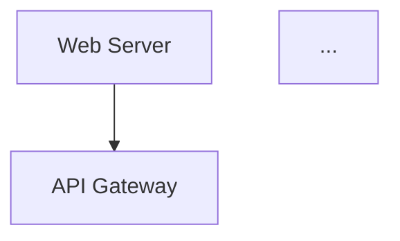

 CURRENT_ARCHITECTURE.md - 真实架构盘点

**生成时间**: 2026-05-15  
**分析对象**: AI-GitHub-Project-Analyzer (当前代码库)  
**分析原则**: Code First, Reality Snapshot, 禁止理想化

---

## 1. 当前目录结构

```
ai-github-analyzer/
├── main.py                          # CLI 入口（Typer）
├── src/
│   ├── scanner/                     # Layer 1: 仓库扫描器
│   │   ├── repo_resolver.py         # 统一解析器（本地/GitHub URL）
│   │   ├── local_scanner.py         # 本地路径扫描
│   │   ├── github_cloner.py         # GitHub 克隆器
│   │   ├── file_scanner.py          # 文件扫描器
│   │   ├── repo_cache_manager.py    # 缓存管理器
│   │   └── models.py                # RepositorySnapshot 模型
│   │
│   ├── analyzer/tech_stack/         # Layer 2: 技术栈分析器（规则驱动）
│   │   ├── detector.py              # 技术检测器
│   │   ├── analyzer.py              # 技术栈分析器
│   │   ├── rules.py                 # 检测规则
│   │   └── parsers/                 # 各语言解析器
│   │       ├── common_parser.py
│   │       ├── python_parser.py
│   │       ├── node_parser.py
│   │       ├── java_parser.py
│   │       └── go_parser.py
│   │
│   ├── context_builder/             # Layer 3: 上下文构建器
│   │   ├── builder.py               # 总编排器
│   │   ├── selector.py              # 文件选择器
│   │   ├── prioritizer.py           # 优先级排序器
│   │   ├── file_reader.py           # 文件读取器
│   │   ├── truncator.py             # 智能裁剪器
│   │   ├── models.py                # ContextFile 等模型
│   │   ├── rules.py                 # 入口文件模式规则
│   │   └── utils.py                 # 工具函数
│   │
│   ├── ai_engine/                   # Layer 4: AI 分析引擎
│   │   ├── orchestrator.py          # AI 总调度器（核心）
│   │   ├── dag.py                   # DAG 调度器（静态顺序）
│   │   ├── registry.py              # 任务注册中心
│   │   ├── llm_client.py            # LLM 客户端（OpenRouter/Qwen）
│   │   ├── prompt_manager.py        # Prompt 管理器
│   │   ├── tasks/                   # 8 个 Task Executor
│   │   │   ├── base.py              # BaseTask 基类
│   │   │   ├── tech_stack_task.py
│   │   │   ├── directory_task.py
│   │   │   ├── core_modules_task.py
│   │   │   ├── startup_task.py
│   │   │   ├── config_task.py
│   │   │   ├── risks_task.py
│   │   │   ├── architecture_task.py
│   │   │   └── learning_path_task.py
│   │   ├── dependency_graph.py      # 依赖图管理（未使用）
│   │   ├── quality_checker.py       # 质量检查器（未集成）
│   │   └── retry_handler.py         # 重试处理器（未集成）
│   │
│   ├── report/                      # Layer 5: 报告生成器
│   │   ├── generator.py             # MarkdownReportGenerator
│   │   ├── template.py              # ReportTemplate（章节渲染）
│   │   ├── formatter.py             # MarkdownFormatter
│   │   ├── validator.py             # ReportValidator
│   │   ├── markdown_writer.py       # MarkdownWriter
│   │   └── utils.py                 # 工具函数
│   │
│   ├── models/                      # 数据模型层
│   │   ├── ai_context.py            # AIContext
│   │   ├── analysis_result.py       # AnalysisResult + 8 个章节模型
│   │   ├── task_context.py          # TaskContext
│   │   ├── prompt_result.py         # PromptResult
│   │   ├── llm_response.py          # LLMResponse
│   │   ├── tech_stack.py            # ProjectTechStack
│   │   └── base_models.py           # 基础模型
│   │
│   ├── ui/                          # UI 层
│   │   ├── cli_dashboard.py         # CLI Dashboard
│   │   ├── progress_manager.py      # 进度管理器
│   │   └── terminal_renderer.py     # 终端渲染器
│   │
│   └── utils/                       # 通用工具
│       └── __init__.py
│
├── prompts/                         # Prompt 模板目录（9 个 .md 文件）
│   ├── system_prompt.md
│   ├── tech_stack.md
│   ├── directory_structure.md
│   ├── core_modules.md
│   ├── startup_flow.md
│   ├── config_analysis.md
│   ├── risks.md
│   ├── architecture_diagram.md
│   └── learning_path.md
│
├── reports/                         # 报告输出目录（空）
├── temp_repos/                      # 临时克隆目录
├── logs/                            # 日志目录
├── traces/                          # Trace 目录（空）
├── schemas/                         # Schema 目录（空）
└── docs/                            # 文档目录
```

---

## 2. 系统入口

**唯一入口**: `main.py` (Typer CLI)

```python
# main.py Line 431-449
@app.command()
def analyze(
    repo_url: str = typer.Argument(...),
    output_format: str = typer.Option("markdown", "--format", "-f"),
    verbose: bool = typer.Option(False, "--verbose", "-v"),
):
```

**启动流程**:
```bash
python main.py analyze <repo_url_or_path>
```

**初始化步骤**:
1. `setup_logging()` - 配置 loguru 日志
2. 创建 Typer app 实例
3. 调用 `analyze()` 命令

---

## 3. 执行链路

### Phase 1: 扫描仓库 (Scanner)
```
main.py Line 468-492
  ↓
RepoResolver.resolve(repo_url)
  ├─ _is_github_url() → 判断类型
  ├─ _handle_github_url() → GitHubCloner.clone()
  │   └─ RepoCacheManager (缓存管理)
  └─ _handle_local_path() → LocalScanner.validate_path()
      └─ FileScanner.scan() → RepositorySnapshot
```

**关键实现**:
- `repo_resolver.py`: 统一入口，区分本地/GitHub
- `github_cloner.py`: git clone 到 `temp_repos/`
- `file_scanner.py`: 遍历文件系统，生成 `RepositorySnapshot`
- **返回**: `RepositorySnapshot` (files + directories)

---

### Phase 2: 技术栈分析 (Tech Stack Analyzer)
```
main.py Line 498-503
  ↓
TechStackAnalyzer.analyze(snapshot)
  ├─ Detector.detect() → 基于规则的检测
  │   ├─ PythonParser
  │   ├─ NodeParser
  │   ├─ JavaParser
  │   └─ GoParser
  └─ Rules (特殊文件信号映射)
```

**关键实现**:
- `detector.py`: 基于文件后缀、特殊文件名匹配
- `rules.py`: 定义技术信号映射（如 `package.json` → Node.js）
- **返回**: `ProjectTechStack` (languages, frameworks, libraries...)

---

### Phase 3: 上下文构建 (Context Builder)
```
main.py Line 509-513
  ↓
ContextBuilder.build(snapshot, tech_stack)
  ├─ ContextSelector.select() → 筛选关键文件
  ├─ ContextPrioritizer.prioritize() → 优先级排序 (S/A/B/C)
  ├─ ContextFileReader.read() → 安全读取文件内容
  ├─ ContextTruncator.truncate() → 大文件裁剪
  └─ _bundle_to_ai_context() → 打包为 AIContext
```

**关键实现**:
- `selector.py`: 基于规则选择重要文件（README、配置文件、入口文件等）
- `prioritizer.py`: 评分排序（S 级: README/dockerfile, A 级: main.py）
- `file_reader.py`: UTF-8 编码，最大 500KB，二进制过滤
- `truncator.py`: Token 预算控制
- **返回**: `AIContext` (files + directories + tech_stack)

---

### Phase 4: AI 分析 (AI Orchestrator) ⭐ 核心
```
main.py Line 520-554
  ↓
DAGScheduler.get_execution_order() → 获取任务顺序
  ↓
AIOrchestrator.run(ai_context)
  ├─ _execute_single_task(task_name, context) × 8 次
  │   ├─ TaskRegistry.get_task() → 获取任务实例
  │   ├─ PromptManager.build_prompt() → 构建 Prompt
  │   ├─ LLMClient.generate() → 调用 OpenRouter/Qwen
  │   ├─ Task._parse_llm_response() → 解析响应
  │   └─ 保存 PromptResult
  └─ _build_analysis_result() → 聚合 8 个结果
```

**任务执行顺序** (`dag.py` Line 31-40):
```python
STATIC_EXECUTION_ORDER = [
    "tech_stack",           # 1. 技术栈分析
    "directory_structure",  # 2. 目录结构分析
    "core_modules",         # 3. 核心模块分析
    "startup_flow",         # 4. 启动流程分析
    "config_analysis",      # 5. 配置分析
    "risks",                # 6. 风险分析
    "architecture_diagram", # 7. 架构图
    "learning_path",        # 8. 学习路径
]
```

**关键组件**:
- `orchestrator.py`: 串行执行 8 个任务，失败继续
- `registry.py`: 任务注册中心（字典映射）
- `llm_client.py`: OpenAI Compatible API (OpenRouter + Qwen)
- `prompt_manager.py`: 加载 prompts/*.md 模板，变量注入
- `tasks/base.py`: BaseTask 基类，提供 `execute_with_llm()` 模板方法
- **返回**: `AnalysisResult` (包含 8 个章节)

---

### Phase 5: 报告生成 (Markdown Generator)
```
main.py Line 560-578
  ↓
MarkdownReportGenerator.generate(analysis_result, repo_path)
  ├─ _render_template() → ReportTemplate.generate_template()
  ├─ _format_markdown() → MarkdownFormatter.format()
  ├─ _validate_report() → ReportValidator.validate()
  └─ _write_file() → MarkdownWriter.write()
```

**关键实现**:
- `template.py`: 渲染 8 个章节为 Markdown
- `formatter.py`: 格式化 Markdown（标题、列表、代码块）
- `validator.py`: 校验完整性（8 章节、Mermaid、文件大小 3-30KB）
- `markdown_writer.py`: 写入 `PROJECT_ANALYSIS.md`
- **返回**: `{success, output_path, validation_result}`

---

## 4. 模块职责

### Layer 1: Scanner (仓库扫描)
| 模块 | 职责 | 输入 | 输出 |
|------|------|------|------|
| `RepoResolver` | 统一解析入口，区分本地/GitHub | repo_url/path | RepositorySnapshot |
| `GitHubCloner` | git clone 到 temp_repos/ | GitHub URL | cloned_path |
| `LocalScanner` | 验证本地路径 | path_str | validated Path |
| `FileScanner` | 遍历文件系统 | repo_path | RepositorySnapshot |
| `RepoCacheManager` | 缓存管理（保留/清理策略） | - | cleanup decision |

### Layer 2: Tech Stack Analyzer (规则驱动)
| 模块 | 职责 | 输入 | 输出 |
|------|------|------|------|
| `TechStackAnalyzer` | 协调检测器和分析器 | RepositorySnapshot | ProjectTechStack |
| `Detector` | 基于规则检测技术 | files list | TechStack |
| `PythonParser` | 解析 requirements.txt/pyproject.toml | file content | dependencies |
| `NodeParser` | 解析 package.json | file content | dependencies |
| `JavaParser` | 解析 pom.xml/build.gradle | file content | dependencies |
| `GoParser` | 解析 go.mod | file content | dependencies |

### Layer 3: Context Builder (上下文构建)
| 模块 | 职责 | 输入 | 输出 |
|------|------|------|------|
| `ContextBuilder` | 总编排器 | snapshot + tech_stack | AIContext |
| `ContextSelector` | 筛选关键文件 | RepositorySnapshot | selected_paths |
| `ContextPrioritizer` | 优先级排序 (S/A/B/C) | paths | sorted_paths |
| `ContextFileReader` | 安全读取文件 | Path | FileReadResult |
| `ContextTruncator` | 大文件裁剪 | ContextFile | truncated_file |

### Layer 4: AI Engine (AI 分析) ⭐
| 模块 | 职责 | 输入 | 输出 |
|------|------|------|------|
| `AIOrchestrator` | 总调度器，串行执行 8 任务 | AIContext | AnalysisResult |
| `DAGScheduler` | 任务顺序管理（当前静态） | - | execution_order |
| `TaskRegistry` | 任务注册中心 | task_name | Task instance |
| `LLMClient` | LLM 调用（OpenRouter/Qwen） | prompt | LLMResponse |
| `PromptManager` | Prompt 模板管理 | task_name + vars | rendered_prompt |
| `BaseTask` | 任务基类，提供模板方法 | TaskContext | Any |
| `TechStackTask` | 技术栈分析任务 | TaskContext | TechStackAnalysis |
| `DirectoryTask` | 目录结构分析任务 | TaskContext | DirectoryStructureAnalysis |
| `CoreModulesTask` | 核心模块分析任务 | TaskContext | CoreModuleAnalysis |
| `StartupTask` | 启动流程分析任务 | TaskContext | StartupFlowAnalysis |
| `ConfigTask` | 配置分析任务 | TaskContext | ConfigAnalysis |
| `RisksTask` | 风险分析任务 | TaskContext | RiskAnalysis |
| `ArchitectureTask` | 架构图生成任务 | TaskContext | ArchitectureDiagram |
| `LearningPathTask` | 学习路径任务 | TaskContext | LearningPath |

### Layer 5: Report Generator (报告生成)
| 模块 | 职责 | 输入 | 输出 |
|------|------|------|------|
| `MarkdownReportGenerator` | 报告生成总控制器 | AnalysisResult | {success, path} |
| `ReportTemplate` | 模板渲染（8 章节） | template_data | Markdown string |
| `MarkdownFormatter` | Markdown 格式化 | raw_markdown | formatted_markdown |
| `ReportValidator` | 质量校验 | Markdown string | ValidationResult |
| `MarkdownWriter` | 文件写入 | content + path | written_path |

### UI Layer
| 模块 | 职责 |
|------|------|
| `CLIDashboard` | CLI 进度显示（Rich Live） |
| `ProgressManager` | 任务进度跟踪 |
| `TerminalRenderer` | 终端渲染（表格、面板） |

---

## 5. Prompt System

### Prompt 文件结构
```
prompts/
├── system_prompt.md       # 系统提示词（角色定义、约束）
├── tech_stack.md          # 技术栈分析 Prompt
├── directory_structure.md # 目录结构分析 Prompt
├── core_modules.md        # 核心模块分析 Prompt
├── startup_flow.md        # 启动流程分析 Prompt
├── config_analysis.md     # 配置分析 Prompt
├── risks.md               # 风险分析 Prompt
├── architecture_diagram.md # 架构图生成 Prompt
└── learning_path.md       # 学习路径 Prompt
```

### Prompt 管理机制

**PromptManager** (`prompt_manager.py`):
```python
# 加载模板
load_template("tech_stack") → prompts/tech_stack.md (UTF-8)

# 构建 Prompt（变量注入）
build_prompt(task_name, variables)
  ├─ load_template(task_name)
  ├─ _extract_variables() → 提取 {{ variable }} 占位符
  └─ re.sub() → 替换变量

# 系统 Prompt
get_system_prompt() → prompts/system_prompt.md
```

### 变量注入机制

**BaseTask._prepare_prompt_variables()** (`tasks/base.py` Line 180-252):
```python
variables = {
    "repo_name": context.ai_context.repo_name,
    "directory_tree": str(context.ai_context.directory_tree),
    "key_files": '\n'.join(context.ai_context.key_files),
    "detected_tech_stack": str(context.ai_context.tech_stack),
    "sampled_code": str(context.ai_context.sampled_code)[:5000],
    "context": str(context.ai_context),
}
```

**示例** (`prompts/tech_stack.md`):
```markdown
# 技术栈分析 Prompt

## 输入变量
- `repo_name`: {{repo_name}}
- `directory_tree`: {{directory_tree}}
- `key_files`: {{key_files}}
- `detected_tech_stack`: {{detected_tech_stack}}
- `sampled_code`: {{sampled_code}}
```

### Prompt 执行流程

**BaseTask.execute_with_llm()** (`tasks/base.py` Line 91-178):
```python
# Step 1: 构建 Prompt
prompt_manager.build_prompt(task_name, variables)

# DEBUG: 打印 Prompt
print("=" * 80)
print(f"[PROMPT] {self.name}")
print(f"Prompt length: {len(prompt)} characters")
print(f"Prompt preview: {prompt[:500]}...")

# Step 2: 调用 LLM
system_prompt = prompt_manager.get_system_prompt()
llm_response = llm_client.generate(
    prompt=prompt,
    system_prompt=system_prompt,
    temperature=0.7,
    max_tokens=4000
)

# DEBUG: 打印 LLM 响应
print("=" * 80)
print(f"[LLM RESPONSE] {self.name}")
print(f"Success: {llm_response.success}")
print(f"Content preview: {str(llm_response.content)[:500]}...")

# Step 3: 解析响应
parsed_result = self._parse_llm_response(llm_response.content, context)

# Step 4: 验证结果
self.validate_result(parsed_result)
```

---

## 6. AI 调用链

### 完整调用链

```
AIOrchestrator.run(ai_context)
  ↓
  for task_name in ["tech_stack", "directory_structure", ...]:
    ↓
    _execute_single_task(task_name, context)
      ↓
      TaskRegistry.get_task(task_name) → TechStackTask()
      ↓
      PromptManager.build_prompt("tech_stack", variables)
        ↓
        load_template("tech_stack") → prompts/tech_stack.md
        ↓
        re.sub("{{repo_name}}", "my-repo", template_content)
        ↓
        rendered_prompt (string)
      ↓
      PromptManager.get_system_prompt() → prompts/system_prompt.md
      ↓
      LLMClient.generate(prompt, system_prompt, temperature=0.7)
        ↓
        OpenAI client.chat.completions.create(
          model="qwen/qwen3-coder:free",
          messages=[
            {"role": "system", "content": system_prompt},
            {"role": "user", "content": prompt}
          ],
          base_url="https://openrouter.ai/api/v1",
          api_key=os.getenv("AI_API_KEY")
        )
        ↓
        OpenRouter API → Qwen 模型
        ↓
        LLMResponse(success=True, content="...", token_usage={...})
      ↓
      Task._parse_llm_response(content, context)
        ↓
        json.loads(content) → TechStackAnalysis
        ↓
        TechStackAnalysis(languages=["Python"], frameworks=["FastAPI"], ...)
      ↓
      PromptResult(task_name="tech_stack", success=True, content=...)
      ↓
      self._prompt_results["tech_stack"] = prompt_result
  ↓
  _build_analysis_result()
    ↓
    _extract_tech_stack() → PromptResult → TechStackAnalysis
    _extract_directory_structure() → PromptResult → DirectoryStructureAnalysis
    ...
    ↓
    AnalysisResult(
      tech_stack=TechStackAnalysis(...),
      directory_structure=DirectoryStructureAnalysis(...),
      ...
    )
```

### LLM 客户端配置

**LLMClient** (`llm_client.py` Line 37-69):
```python
def __init__(self):
    self.provider = os.getenv("AI_PROVIDER") or "openai_compatible"
    self.model = os.getenv("AI_MODEL") or "qwen/qwen3-coder:free"
    self.api_key = os.getenv("AI_API_KEY") or ""
    self.base_url = os.getenv("AI_BASE_URL") or "https://openrouter.ai/api/v1"
    
    self.client = OpenAI(
        api_key=self.api_key,
        base_url=self.base_url
    )
```

**环境变量** (`.env`):
```env
AI_PROVIDER=openai_compatible
AI_MODEL=qwen/qwen3-coder:free
AI_API_KEY=sk-or-v1-...
AI_BASE_URL=https://openrouter.ai/api/v1
AGENT_TIMEOUT=60
```

---

## 7. Executor 关系

### 任务注册表

**TaskRegistry** (`registry.py` Line 23-32):
```python
TASK_REGISTRY = {
    "tech_stack": TechStackTask,
    "directory_structure": DirectoryTask,
    "core_modules": CoreModulesTask,
    "startup_flow": StartupTask,
    "config_analysis": ConfigTask,
    "risks": RisksTask,
    "architecture_diagram": ArchitectureTask,
    "learning_path": LearningPathTask,
}
```

### 任务继承关系

```
BaseTask (抽象基类)
  ├─ execute() → 抽象方法
  ├─ execute_with_llm() → 模板方法（Step 1-4）
  ├─ get_prompt_template() → 抽象方法
  ├─ validate_result() → 抽象方法
  └─ _prepare_prompt_variables() → 可重写
  
  ├─ TechStackTask
  │   ├─ get_prompt_template() → "tech_stack"
  │   ├─ _parse_llm_response() → JSON → TechStackAnalysis
  │   └─ validate_result() → isinstance check
  │
  ├─ DirectoryTask
  ├─ CoreModulesTask
  ├─ StartupTask
  ├─ ConfigTask
  ├─ RisksTask
  ├─ ArchitectureTask
  └─ LearningPathTask
```

### 任务执行关系

**AIOrchestrator** (`orchestrator.py` Line 98-100):
```python
# 串行执行，无并行
for task_name in execution_order:
    self._execute_single_task(task_name, context)
```

**关键特性**:
- ✅ 失败继续：单任务失败不中断流程
- ✅ 日志记录：每个任务开始/成功/失败/耗时
- ❌ 无并行：当前串行执行
- ❌ 无重试：retry_handler.py 存在但未集成
- ❌ 无缓存：结果不缓存，每次都调用 LLM

---

## 8. Workflow

### DAG 工作流（当前实现）

**DAGScheduler** (`dag.py` Line 31-40):
```python
STATIC_EXECUTION_ORDER = [
    "tech_stack",           # 1
    "directory_structure",  # 2
    "core_modules",         # 3
    "startup_flow",         # 4
    "config_analysis",      # 5
    "risks",                # 6
    "architecture_diagram", # 7
    "learning_path",        # 8
]
```

**特点**:
- ✅ 有向无环图（DAG）结构
- ✅ 预定义静态顺序
- ❌ 无动态依赖计算
- ❌ 无并行任务组（`get_parallel_groups()` 返回每组一个任务）
- ❌ 依赖图未使用（`dependency_graph.py` 存在但未集成）

**未来扩展点**:
```python
# Line 129-141: 预留并行接口
def get_parallel_groups(self) -> List[List[str]]:
    # 当前实现：每个任务单独一组（串行执行）
    parallel_groups = [[task] for task in self._execution_order]
    return parallel_groups
```

### 实际执行流程

```
Phase 1: Scanner (同步)
  ↓
Phase 2: Tech Stack Analyzer (同步，规则驱动)
  ↓
Phase 3: Context Builder (同步)
  ↓
Phase 4: AI Engine (串行，8 个 LLM 调用)
  ├─ Task 1: tech_stack → LLM call 1
  ├─ Task 2: directory_structure → LLM call 2
  ├─ Task 3: core_modules → LLM call 3
  ├─ Task 4: startup_flow → LLM call 4
  ├─ Task 5: config_analysis → LLM call 5
  ├─ Task 6: risks → LLM call 6
  ├─ Task 7: architecture_diagram → LLM call 7
  └─ Task 8: learning_path → LLM call 8
  ↓
Phase 5: Report Generator (同步)
```

**总耗时**: ~60-120 秒（取决于 LLM 响应速度）

---

## 9. Result Flow

### 数据流转

```
RepositorySnapshot (Layer 1)
  ↓ files + directories
ProjectTechStack (Layer 2)
  ↓ languages + frameworks + ...
AIContext (Layer 3)
  ↓ files + directories + tech_stack
  ↓
TaskContext (Layer 4)
  ↓ ai_context + task_config
  ↓
PromptResult × 8 (Layer 4)
  ↓ task_name + success + content
  ↓
AnalysisResult (Layer 4)
  ├─ tech_stack: TechStackAnalysis
  ├─ directory_structure: DirectoryStructureAnalysis
  ├─ core_modules: CoreModuleAnalysis
  ├─ startup_flow: StartupFlowAnalysis
  ├─ config_analysis: ConfigAnalysis
  ├─ risks: RiskAnalysis
  ├─ architecture_diagram: ArchitectureDiagram
  └─ learning_path: LearningPath
  ↓
Markdown String (Layer 5)
  ↓
PROJECT_ANALYSIS.md (文件系统)
```

### 关键模型

**RepositorySnapshot** (`scanner/models.py`):
```python
class RepositorySnapshot(BaseModel):
    repo_name: str
    repo_path: Path
    files: List[FileMetadata]
    directories: List[DirectoryMetadata]
```

**AIContext** (`models/ai_context.py`):
```python
class AIContext(BaseModel):
    repo_name: str
    repo_path: Path
    files: List[FileContext]
    directories: List[DirectoryContext]
    tech_stack: Optional[TechStackContext]
    token_budget: int = 50000
```

**PromptResult** (`models/prompt_result.py`):
```python
class PromptResult(BaseModel):
    task_name: str
    success: bool
    content: Optional[str]
    elapsed_time: float
    error_message: Optional[str]
```

**AnalysisResult** (`models/analysis_result.py`):
```python
class AnalysisResult(BaseModel):
    repo_name: str
    analysis_time: datetime
    tech_stack: Optional[TechStackAnalysis]
    directory_structure: Optional[DirectoryStructureAnalysis]
    core_modules: Optional[CoreModuleAnalysis]
    startup_flow: Optional[StartupFlowAnalysis]
    config_analysis: Optional[ConfigAnalysis]
    risks: Optional[RiskAnalysis]
    architecture_diagram: Optional[ArchitectureDiagram]
    learning_path: Optional[LearningPath]
    elapsed_time: float
```

---

## 10. Report Generator

### 报告生成流程

**MarkdownReportGenerator** (`report/generator.py` Line 53-143):
```python
def generate(analysis_result, repo_path):
    # Step 1: 渲染模板
    rendered_content = self._render_template(analysis_result)
      ↓
      ReportTemplate.generate_template(template_data)
        ├─ _render_header() → "# {repo_name} 项目分析报告"
        ├─ _render_tech_stack() → "## 一、技术栈分析"
        ├─ _render_directory_structure() → "## 二、目录结构"
        ├─ _render_core_modules() → "## 三、核心模块"
        ├─ _render_startup_flow() → "## 四、启动流程"
        ├─ _render_config_analysis() → "## 五、配置说明"
        ├─ _render_risks() → "## 六、风险分析"
        ├─ _render_architecture_diagram() → "## 七、架构图"
        └─ _render_learning_path() → "## 八、学习路线"
    
    # Step 2: 格式化 Markdown
    formatted_content = self._format_markdown(rendered_content)
      ↓
      MarkdownFormatter.format()
        ├─ 统一标题格式
        ├─ 规范空行和列表
        ├─ 格式化代码块
        └─ 修复常见问题
    
    # Step 3: 质量校验
    validation_result = self._validate_report(formatted_content)
      ↓
      ReportValidator.validate()
        ├─ 检查 8 个章节完整性
        ├─ 检查 Mermaid 存在性
        ├─ 检查文件大小 (3KB ~ 30KB)
        ├─ 检查风险分析三段式结构
        └─ 检查 Markdown 基础语法
    
    # Step 4: 写入文件
    output_file = self._write_file(formatted_content, repo_path)
      ↓
      MarkdownWriter.write()
        └─ repo_path / "PROJECT_ANALYSIS.md"
```

### 报告结构

**生成的 Markdown 文件**:
```markdown
# {repo_name} 项目分析报告

> 生成时间: {analysis_time}

---

## 一、技术栈分析

### 编程语言
- Python 3.10+

### 框架
- FastAPI

...

## 二、目录结构

...

## 三、核心模块

...

## 四、启动流程

### 环境准备
1. 安装 Python 3.10+
2. 创建虚拟环境

### 启动命令
```bash
python main.py
```

...

## 五、配置说明

...

## 六、风险分析

### 高风险
- ...

### 中风险
- ...

### 低风险
- ...

## 七、架构图



## 八、学习路线

...
```

### 质量校验规则

**ReportValidator** (`report/validator.py`):
```python
# 必需章节检查
REQUIRED_SECTIONS = [
    "一、技术栈分析",
    "二、目录结构",
    "三、核心模块",
    "四、启动流程",
    "五、配置说明",
    "六、风险分析",
    "七、架构图",
    "八、学习路线",
]

# Mermaid 检查
if "```mermaid" not in content:
    errors.append(("MISSING_MERMAID", "缺少 Mermaid 架构图"))

# 文件大小检查
file_size_kb = len(content.encode('utf-8')) / 1024
if file_size_kb < 3:
    errors.append(("FILE_TOO_SMALL", f"文件过小: {file_size_kb:.1f}KB"))
if file_size_kb > 30:
    errors.append(("FILE_TOO_LARGE", f"文件过大: {file_size_kb:.1f}KB"))

# 风险分析三段式检查
if "高风险" not in content or "中风险" not in content or "低风险" not in content:
    errors.append(("RISK_STRUCTURE", "风险分析缺少三段式结构"))
```

---

## 总结：真实架构特点

### ✅ 已实现
1. **5 层清晰架构**: Scanner → Tech Stack → Context Builder → AI Engine → Report
2. **CLI 入口**: Typer + Rich，用户体验良好
3. **Prompt 外部化**: 9 个 .md 文件，与代码解耦
4. **任务注册中心**: 避免 if-else 地狱，支持扩展
5. **失败继续**: 单任务失败不中断整个流程
6. **Dashboard UI**: Rich Live 显示进度
7. **报告校验**: 8 章节完整性、Mermaid、文件大小

### ⚠️ 部分实现
1. **DAG 调度器**: 有 DAG 结构，但当前串行执行
2. **任务基类**: BaseTask 提供模板方法，但各 Task 实现不完整
3. **LLM 客户端**: 仅支持 OpenRouter/Qwen，无多提供商切换
4. **结果解析**: 大部分 Task 返回空对象或简单截取，未充分解析 LLM 响应

### ❌ 未实现
1. **并行执行**: `get_parallel_groups()` 返回串行
2. **重试机制**: `retry_handler.py` 存在但未集成
3. **质量检查**: `quality_checker.py` 存在但未集成
4. **依赖图**: `dependency_graph.py` 存在但未使用
5. **缓存机制**: Prompt 结果不缓存，每次都调用 LLM
6. **Token 计算**: `estimated_tokens=0`，未实际计算
7. **结构化解析**: 大部分 Task 的 `_parse_llm_response()` 是占位实现

### 🔧 技术栈
- **语言**: Python 3.10+
- **CLI**: Typer + Rich
- **LLM**: OpenAI SDK + OpenRouter API + Qwen 免费模型
- **异步**: asyncio (仅用于 Scanner)
- **日志**: loguru
- **配置**: dotenv + 环境变量
- **数据模型**: Pydantic

### 📊 代码规模
- **核心代码**: ~5000 行 Python
- **Prompt 模板**: 9 个 .md 文件
- **任务数**: 8 个 Task Executor
- **模型数**: ~15 个 Pydantic 模型
- **依赖**: openai, typer, rich, loguru, pydantic, python-dotenv

---

**文档结束**
