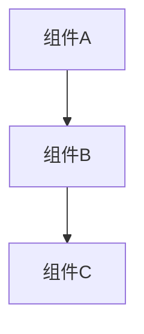

# 架构图生成 Prompt

## 任务描述

生成项目的 Mermaid 架构图。

## 输入变量

- `repo_name`: {{repo_name}}
- `directory_tree`: {{directory_tree}}
- `key_files`: {{key_files}}
- `detected_tech_stack`: {{detected_tech_stack}}
- `sampled_code`: {{sampled_code}}

## 输出要求

**必须仅返回合法的 Mermaid 代码**，格式如下：

包含：
- 系统整体架构
- 模块间调用关系
- 数据流向
- 外部依赖

## 约束条件

- **只能使用 Mermaid 语法**（graph、flowchart、sequenceDiagram、classDiagram 等）
- **禁止返回普通中文解释**
- **禁止返回“请提供xxx”之类的提示**
- 保持图表简洁清晰
- 标注关键组件
- 避免过度复杂
